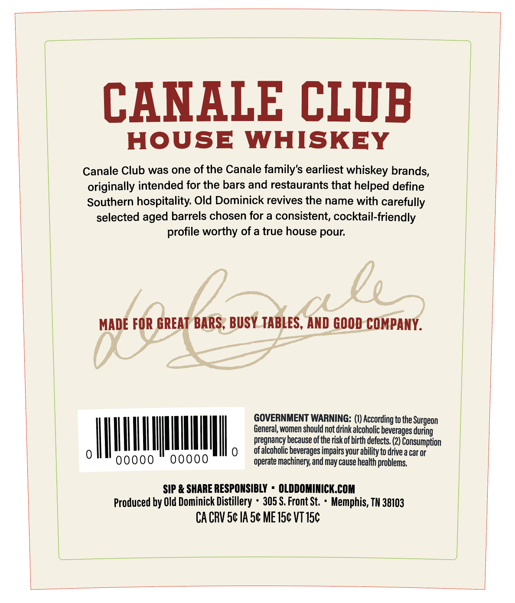
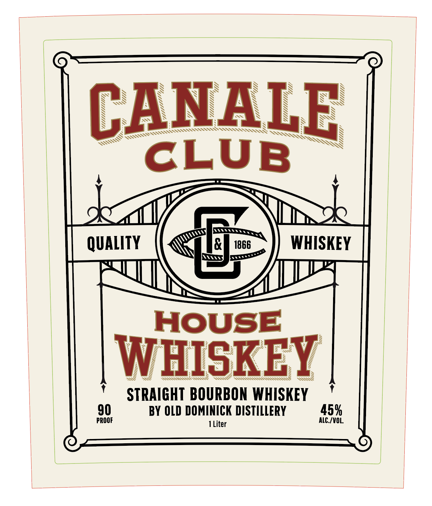
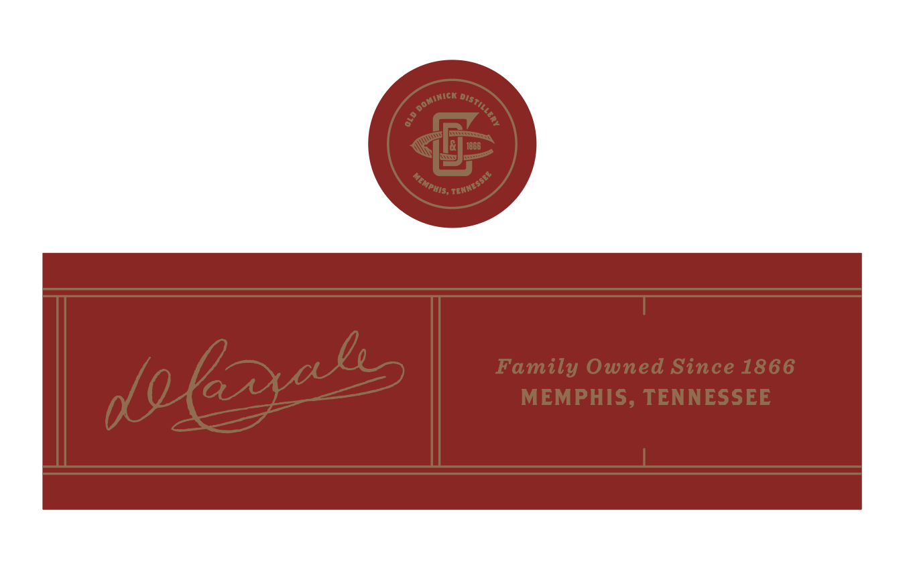

# TTB COLA Label Images - TTBID 26141001000775

**Brand Name:** CANALE CLUB

**Fanciful Name:** HOUSE WHISKEY

**Issue Date:** 05/28/2026

**Origin Code:** 43

**Product Class/Type:** 101

**Source:** [TTB Public COLA Registry](https://ttbonline.gov/colasonline/viewColaDetails.do?action=publicFormDisplay&ttbid=26141001000775)

## Label Images

### Back Label

### Front Label

### Label 2

## Extracted Label Text

*Text extracted via OCR - may contain errors*

**Detected Proof:** 90

### Back Label

CANALE CLUB
HOUSE
WHISKEY
Canale Club was one of the Canale family's earliest whiskey brands,
originally intended for the bars and restaurants that helped define
Southern hospitality Old Dominick revives the name with carefully
selected aged barrels chosen for a consistent, cocktail-friendly
worthy ofa true house pour
cly
MADE FOR GREAT BARS , BUSY TABLES, AND GOOD COMPANY.
GOVERNMENT WARNING: (0) According to the :
General, women should not drink alcoholic beverages during
pregnancy because ofthe riskof birth defects; (2} Consumption
ofalcoholic beverages impairs your ability to drive a car or
00000
operate machinery; and may cause health problems;
SIP & SHARE RESPONSIBLY
OLDDOMINICK.COM
Produced by Old Dominick Distillery
305 $. Front St,
Memphis, TN 38103
CA CRV Sc IA 5c ME 15c VT I5c
profile
Surgeon

### Front Label

CANALR
CLUB
QUALITY
1866
WHISKEY
HOUSE
WHISKEY
STRAIGHT BOURBON  WHISKEY
90
BY OLD DOMINICK DISTILLERY
45%
PROOF
ALC_/VOL
Liter

### Label 2

1066
Family Owned Since 1866
MEMPHIS, TENNESSEE
Dominici ,
DIStILlery
8
TENNEssLE
Memphis;
dolzxals
