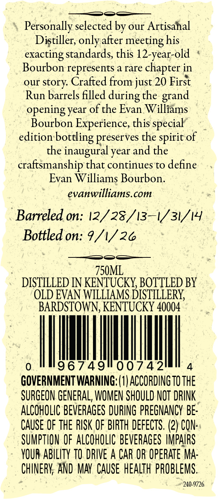
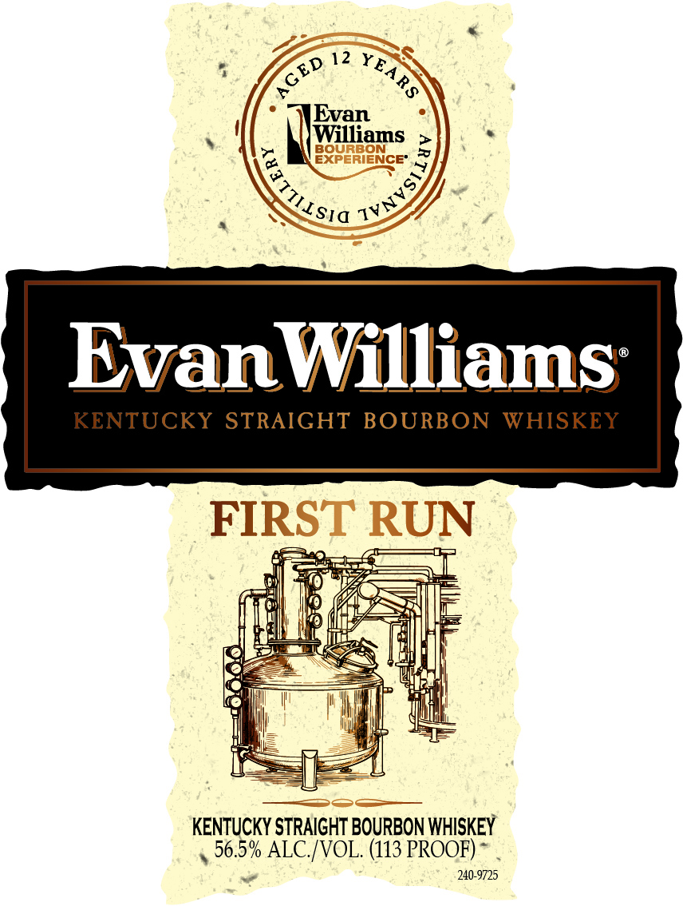

# TTB COLA Label Images - TTBID 26141001000793

**Brand Name:** EVAN WILLIAMS

**Fanciful Name:** FIRST RUN

**Issue Date:** 05/28/2026

**Origin Code:** 22

**Product Class/Type:** 101

**Source:** [TTB Public COLA Registry](https://ttbonline.gov/colasonline/viewColaDetails.do?action=publicFormDisplay&ttbid=26141001000793)

## Label Images

### Back Label

### Label 1

## Extracted Label Text

*Text extracted via OCR - may contain errors*

**Detected Proof:** 113

### Back Label

Personally selected by our Artisahal
Distiller, only after meeting his

exacting standards, this 12-year-old *
Bourbon represents a rare chapter in

our story. Crafted from just 20 First

Run barrels filled during the grand

opening year of the Evan Williams

Bourbon Experience, this special
edition bottling preserves the spirit of
the inaugural year and the
craftsmanship that continues to define
Evan Williams Bourbon.
evanwilliams.com
Barreled on: 12/25/1317 31/14
Bottled on: 9/1/26
750ML
DISTILLED IN KENTUCKY, BOTTLED BY
OLD EVAN WILLIAMS DISTILLERY,
BARDSTOWN, KENTUCKY 40004
GOVERNMENT WARNING: (1) ACCORDING T0 THE
SURGEON GENERAL, WOMEN SHOULD NOT DRINK
ALCOHOLIC BEVERAGES DURING PREGNANCY BE-
CAUSE OF THE RISK OF BIRTH DEFECTS. (2) CON:
SUMPTION OF ALCOHOLIC BEVERAGES IMPAIRS
YOUR ABILITY TO. DRIVE A CAR OR OPERATE MA-
CHINERY; AND MAY CAUSE HEALTH PROBLEMS.
240-9726

### Label 1

12
Evan
Williams
g32ER1@NcE'
EvanWilliams
KENTUCKY
STRAIGHT BOURBON
WHISKEY
FIRST RUN
56.5% ALC/VOL. (113 PROOF)
240-9725
YEARS
CED
{VITIHISIO
TVNVS)
