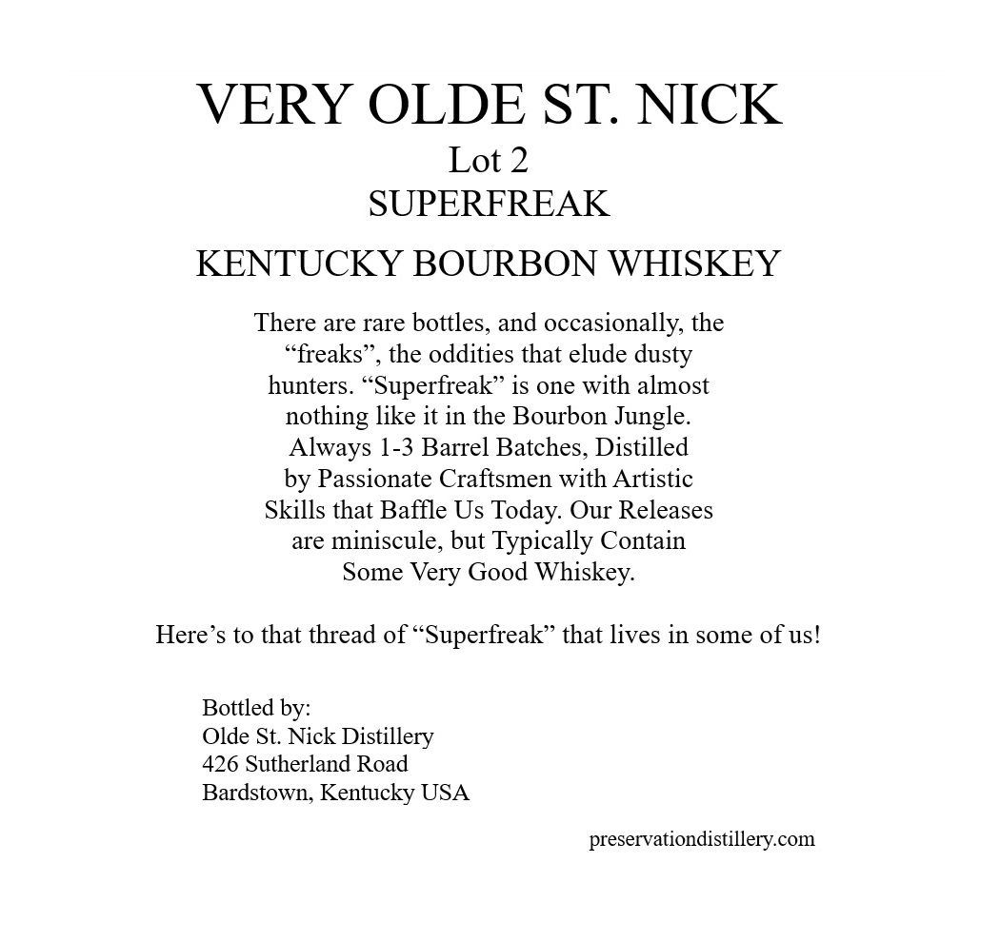
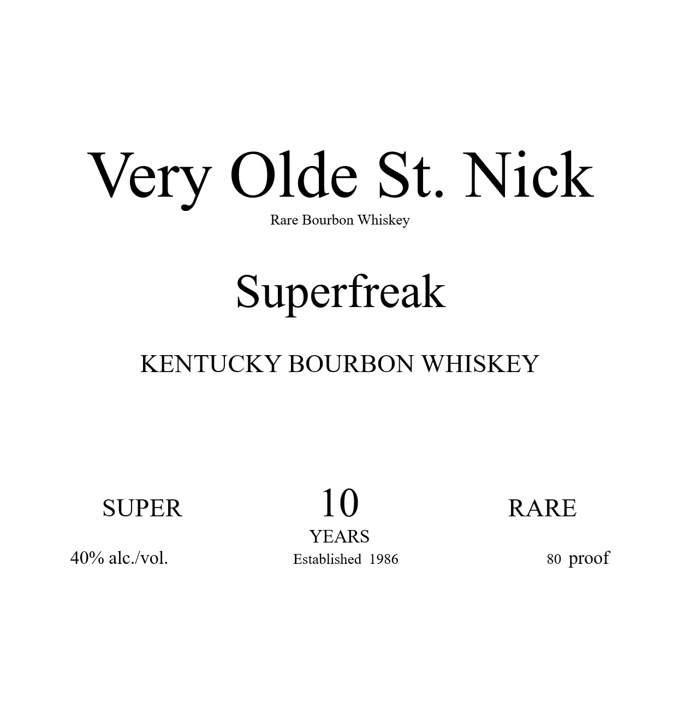

# TTB COLA Label Images - TTBID 26141001000799

**Brand Name:** VERY OLDE ST. NICK

**Issue Date:** 05/28/2026

**Origin Code:** 22

**Product Class/Type:** 141

**Source:** [TTB Public COLA Registry](https://ttbonline.gov/colasonline/viewColaDetails.do?action=publicFormDisplay&ttbid=26141001000799)

## Label Images

### Back Label

### Label 1

### Label 3

## Extracted Label Text

*Text extracted via OCR - may contain errors*

**Detected Proof:** 80

### Back Label

VERY OLDE ST: NICK
Lot 2
SUPERFREAK
KENTUCKY BOURBON WHISKEY
There are rare bottles, and occasionally, the
"freaks
the oddities that elude dusty
hunters _
Superfreak" is one with almost
nothing like it in the Bourbon Jungle:
Always 1-3 Barrel Batches, Distilled
by Passionate Craftsmen with Artistic
Skills that Baffle Us Today: Our Releases
are
miniscule, but Typically Contain
Some Very Good Whiskey:
Here's to that thread of "Superfreak" that lives in some of us!
Bottled by:
Olde St: Nick Distillery
426 Sutherland Road
Bardstown; Kentucky USA
preservationdistillery.com

### Label 1

Very Olde St. Nick

Rare Bourbon Whiskey

Superfreak

KENTUCKY BOURBON WHISKEY

SUPER

10

RARE

YEARS

40% alc./vol.

Established 1986

80 proof

### Label 3

GOVERNMENT WARNING:
ACCORDING
TO
THE
SURGEON
GENERAL
INGmeR) AGSORDH
NOT
DRINK
ALcOHOLic
BEVERAGES
DURiNG
PREGNANCY
BECAUSE
OF
THE
RISK
OF
BIRTH
DEFFECTS
CONSUMpTION
OF
Alcoholic
BEVERAGES
IMPAIRS
YOUR
ABILITY
TO
DRIVE
A
CAR OR
OPERATE
MACHINERK
ANd
MAY
CAUSE
HEALTH
PROBLEMS.
UPC- FOR POSITION ONLY
750ML
