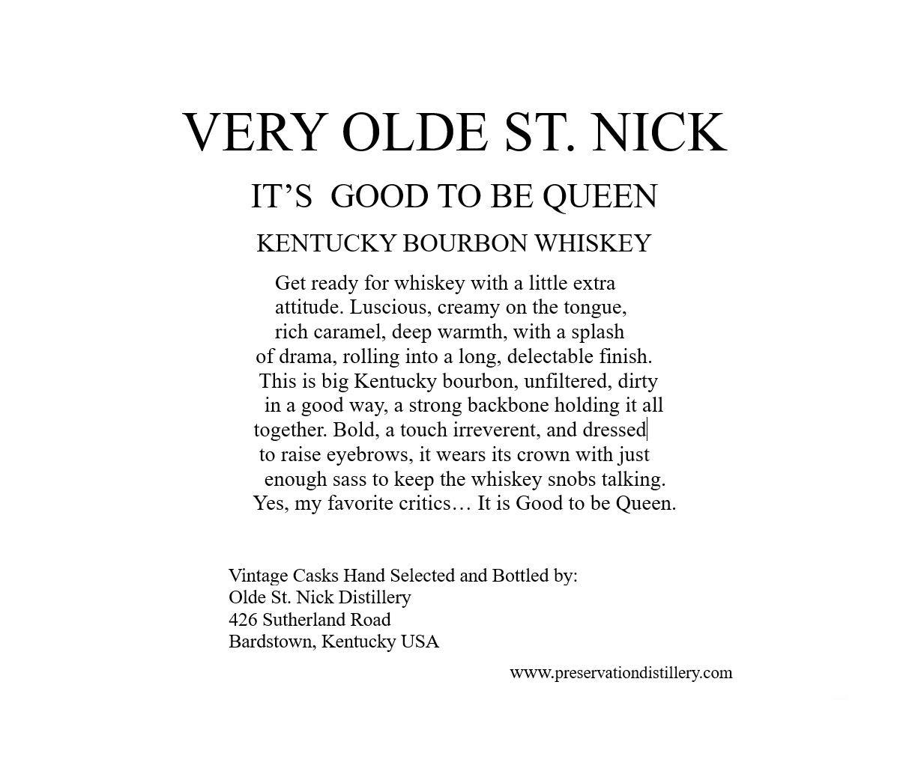
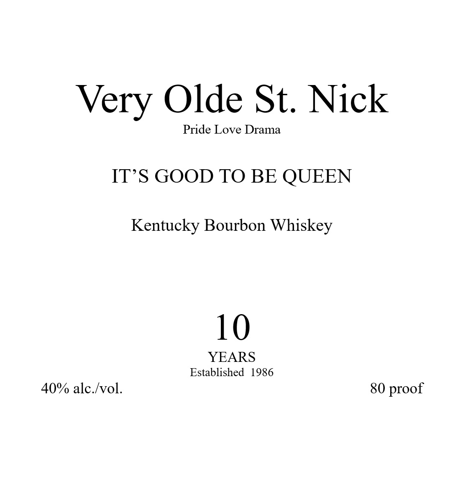

# TTB COLA Label Images - TTBID 26141001000907

**Brand Name:** VERY OLDE ST. NICK

**Issue Date:** 05/28/2026

**Origin Code:** 22

**Product Class/Type:** 141

**Source:** [TTB Public COLA Registry](https://ttbonline.gov/colasonline/viewColaDetails.do?action=publicFormDisplay&ttbid=26141001000907)

## Label Images

### Back Label

### Label 1

### Label 3

## Extracted Label Text

*Text extracted via OCR - may contain errors*

**Detected Proof:** 80
**Detected Age:** 10 Years

### Back Label

VERY OLDE ST NICK
ITS
GOOD TO BE QUEEN
KENTUCKY BOURBON WHISKEY
Get ready for whiskey with a little extra
attitude. Luscious, creamy on the tongue,
rich caramel, deep warmth, with a splash
of drama, rolling into a
delectable finish:
This is big Kentucky bourbon, unfiltered, dirty
in a
way; a
backbone holding it all
together: Bold, a touch irreverent; and dressed
to raise eyebrows, it wears its crown with just
enough sass to keep the whiskey snobs talking:
Yes, my favorite critics_
It is Good to be Queen
Vintage Casks Hand Selected and Bottled by:
Olde St: Nick Distillery
426 Sutherland Road
Bardstown; Kentucky USA
WWWpreservationdistillerycom
long;
good
strong

### Label 1

Very Olde St. Nick

Pride Love Drama

IT’S GOOD TO BE QUEEN

Kentucky Bourbon Whiskey

10

YEARS

Established 1986

40% alc./vol.

80 proof

### Label 3

GOVERNMENT WARNING:
ACCORDING
TO
THE
SURGEON
GENERAL
INGmeR) AGSORDH
NOT
DRINK
ALcOHOLic
BEVERAGES
DURiNG
PREGNANCY
BECAUSE
OF
THE
RISK
OF
BIRTH
DEFFECTS
CONSUMpTION
OF
Alcoholic
BEVERAGES
IMPAIRS
YOUR
ABILITY
TO
DRIVE
A
CAR OR
OPERATE
MACHINERK
ANd
MAY
CAUSE
HEALTH
PROBLEMS.
UPC- FOR POSITION ONLY
750ML
