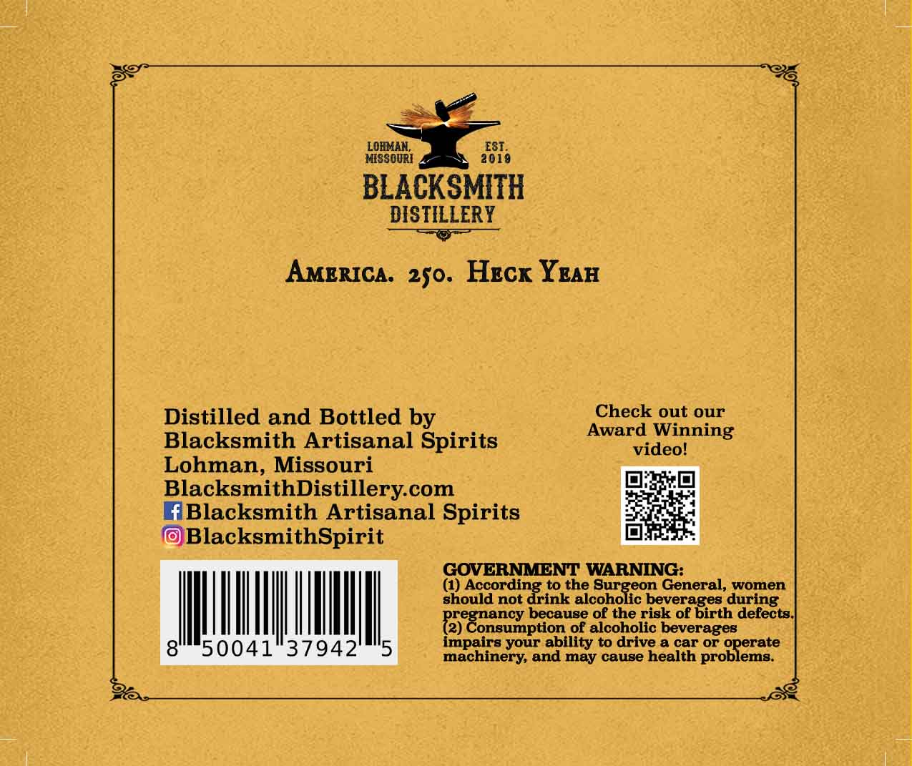
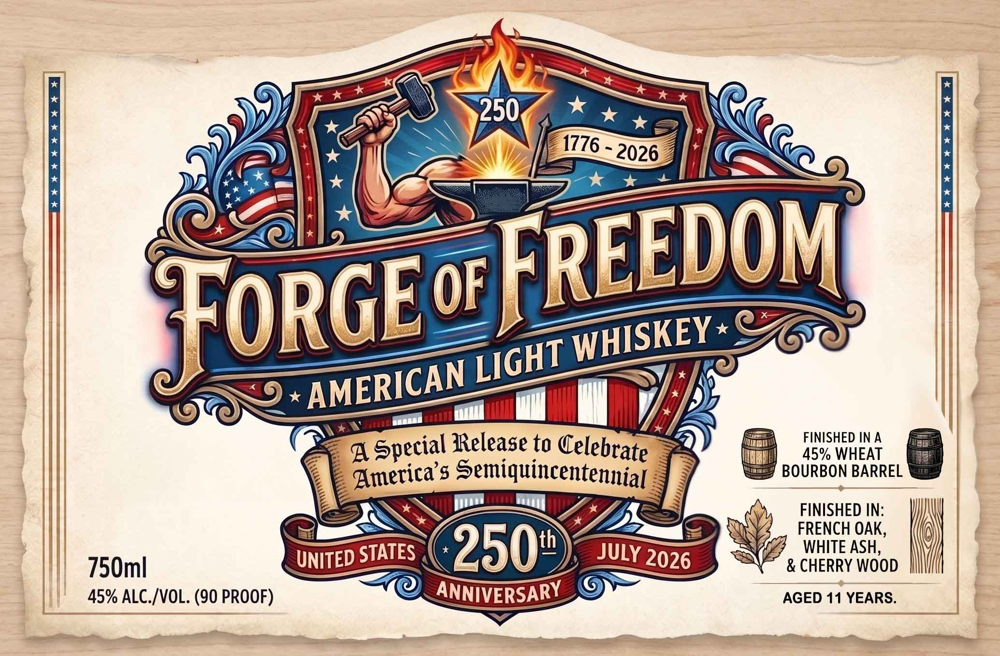

# TTB COLA Label Images - TTBID 26141001000950

**Brand Name:** FORGE OF FREEDOM

**Issue Date:** 05/29/2026

**Origin Code:** 29

**Product Class/Type:** 144

**Source:** [TTB Public COLA Registry](https://ttbonline.gov/colasonline/viewColaDetails.do?action=publicFormDisplay&ttbid=26141001000950)

## Label Images

### Back Label

### Label 1

## Extracted Label Text

*Text extracted via OCR - may contain errors*

**Detected Proof:** 90
**Detected Age:** 11 Years

### Back Label

LOAMAN,
EST_
MISSOURI
2019
BLACKSMITH
DISTILLERY
AMERICA:2f0. Hecr YEAH
Distilled and Bottled by
Check out our
Award
Winning
Blacksmith Artisanal Spirits
videol
Lohman, Missouri
BlacksmithDistillerycom
fBlacksmith Artisanal Spirits
BlacksmithSpirit
GOVERNMENT WARNING:
(0) According to the
General, women
should not drink
hicoholicon
during
because of the risk
rhexeoz Betkd
of
defects _
Begonsonbeog
of alcoholic beverages
8
50041
37942'
5
impairg your ability to drive & car
proBleraste
Or
machinery; and may cause health

### Label 1

*
250
;
1776
2026
:
'
*
FoRGEo]
RRelease to
FINISHED IN A
A
45% WHEAT
S
Semiquincentennial
BOURBON BARREL
FINISHED IN:
FRENCH OAK,
UNITED STATES
250
Ith
JULY 2026
WHITE ASH;
750ml
CHERRY WOOD
45% ALC /VOL. (90 PROOF)
ANNIVERSARY
AGED 11 YEARS:
4 * * *
FREEDOM
WHISKEY
LIGHT
AMERICAN
Special
(elebrate
America =
