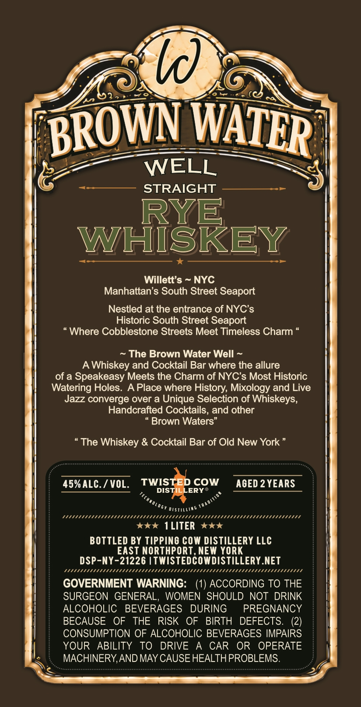
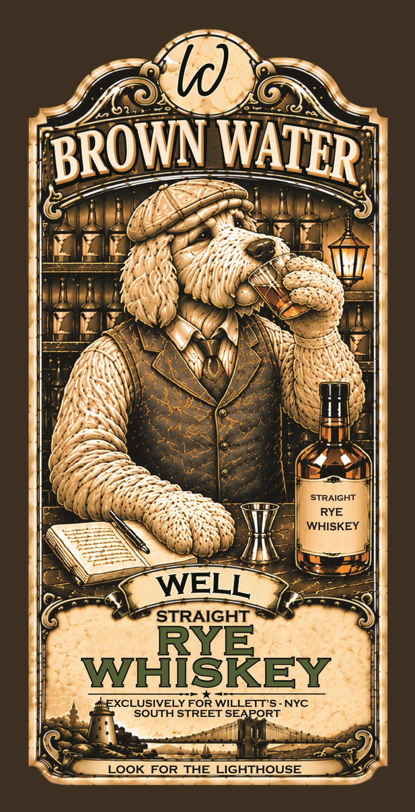

# TTB COLA Label Images - TTBID 26141001000998

**Brand Name:** BROWN WATER WELL STRAIGHT RYE WHISKEY

**Issue Date:** 05/28/2026

**Origin Code:** 02

**Product Class/Type:** 102

**Source:** [TTB Public COLA Registry](https://ttbonline.gov/colasonline/viewColaDetails.do?action=publicFormDisplay&ttbid=26141001000998)

## Label Images

### Back Label

### Front Label

## Extracted Label Text

*Text extracted via OCR - may contain errors*

**Detected Proof:** 90
**Detected Age:** 2 Years

### Back Label

Ic)
WELL
STRAIGHT
RYE
WHISKEY
Willett' $
NYC
Manhattan's South Street Seaport
Nestled at the entrance of NYC's
Historic South Street Seaport
Where Cobblestone Streets Meet Timeless Charm
The Brown Water Well
Whiskey and Cocktail Bar where the allure
of a Speakeasy Meets the Charm of NYCs Most Historic
Watering Holes. A Place where History; Mixology and Live
Jazz converge over a Unique Selection of Whiskeys;
Handcrafted Cocktails, and other
Brown Waters"
The Whiskey & Cocktail Bar of Old New York
45% ALC. / VOL.
TWISTE
COw
AGED 2 YEARS
DISTILLERY "
OGy 01STILLIXG
Se
1 LITER
BOTTLED BY Tippino COW DISTILLERY LLC
EAST NORTHPORT,NEW YORK
DSP-NY-21226 |TMISTEDCOWDISTILLERY.NET
Ennnnnnnnnnnnn
Fnnnnnn
GOVERNMENT WARNING:
(1) ACCORDING TO THE
SURGEON GENERAL,
WOMEN SHOULD NOT DRINK
ALCOHOLIC
BEVERAGES
DURING
PREGNANCY
BECAUSE
OF
THE
RISK
OF
BIRTH   DEFECTS.
(2)
CONSUMPTION OF ALCOHOLIC BEVERAGES IMPAIRS
YOUR
ABILITY
To
DRIVE
CAR
OR
OPERATE
MACHINERY,AND MAY CAUSE HEALTHPROBLEMS:
BROWN
WATER
TItanole
0tiDT

### Front Label

ld)
STRAIGHT
RYE
WHISKEY
WELL
STRAIGHT
RYE
WHISKEY
EXCLUSIVELY FOR WILLETT'S-NYC
SOUTH STREET SEAPORT
LOOK
FOR
THE LIGHTHOUSE
BROWN
WATER
