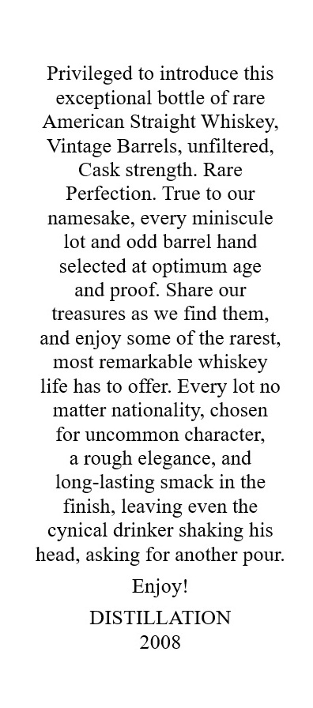
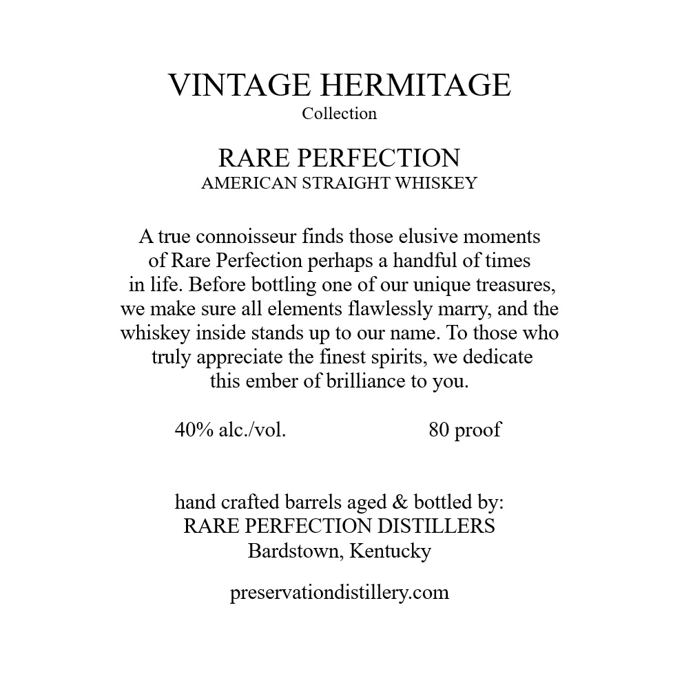
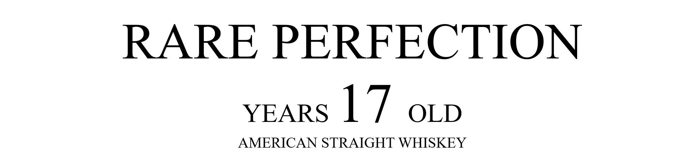

# TTB COLA Label Images - TTBID 26141001001008

**Brand Name:** RARE PERFECTION

**Issue Date:** 05/29/2026

**Origin Code:** 22

**Product Class/Type:** 100

**Source:** [TTB Public COLA Registry](https://ttbonline.gov/colasonline/viewColaDetails.do?action=publicFormDisplay&ttbid=26141001001008)

## Label Images

### Back Label

### Label 1

### Label 2

### Label 3

## Extracted Label Text

*Text extracted via OCR - may contain errors*

**Detected Proof:** 80

### Back Label

Privileged to introduce this
exceptional bottle of rare
American Straight Whiskey,
Vintage Barrels, unfiltered;
Cask strength: Rare
Perfection: True to our
namesake, every miniscule
lot and odd barrel hand
selected at optimum age
and proof: Share OUI
treasures as we find them,
and
enjoy some of the rarest,
most remarkable whiskey
life has to offer: Every lot no
matter nationality; chosen
for uncommon character;
rough elegance, and
long-lasting smack in the
finish, leaving even the
cynical drinker shaking his
head, asking for another
Enjoy!
DISTILLATION
2008
pour:

### Label 1

VINTAGE HERMITAGE
Collection
RARE PERFECTION
AMERICAN STRAIGHT WHISKEY
true connoisseur finds those elusive moments
of Rare Perfection perhaps a handful of times
in life. Before
one of our unique treasures,
we make sure all elements flawlessly marry, and the
whiskey inside stands up to our name To those who
truly appreciate the finest spirits, we dedicate
this ember of brilliance to you:
40% alc Ivol.
80
hand crafted barrels
& bottled by:
RARE PERFECTION DISTILLERS
Bardstown, Kentucky
preservationdistillery.com
bottling
proof
aged

### Label 2

RARE PERFECTION
YEARS
17
OLD
AMERICAN STRAIGHT WHISKEY

### Label 3

GOVERNMENT WARNING:
ACCORDING
TO
THE
SURGEON
GENERAL
INGmeR) AGSORDH
NOT
DRINK
ALcOHOLic
BEVERAGES
DURiNG
PREGNANCY
BECAUSE
OF
THE
RISK
OF
BIRTH
DEFFECTS
CONSUMpTION
OF
Alcoholic
BEVERAGES
IMPAIRS
YOUR
ABILITY
TO
DRIVE
A
CAR OR
OPERATE
MACHINERK
ANd
MAY
CAUSE
HEALTH
PROBLEMS.
UPC- FOR POSITION ONLY
750ML
