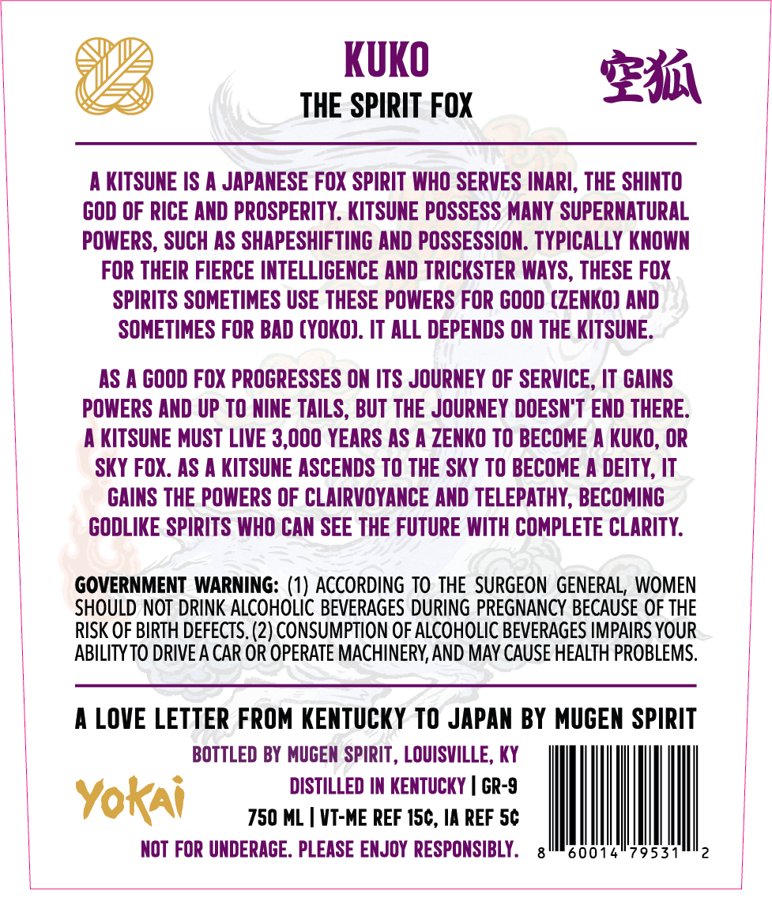
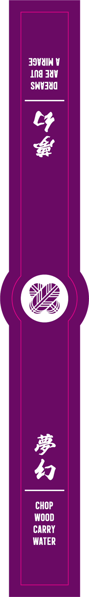

# TTB COLA Label Images - TTBID 26141001001019

**Brand Name:** YOKAI

**Issue Date:** 05/28/2026

**Origin Code:** 22

**Product Class/Type:** 101

**Source:** [TTB Public COLA Registry](https://ttbonline.gov/colasonline/viewColaDetails.do?action=publicFormDisplay&ttbid=26141001001019)

## Label Images

### Back Label

### Front Label

### Label 2

## Extracted Label Text

*Text extracted via OCR - may contain errors*

*1 image(s) excluded: text did not meet readability threshold*

### Back Label

KUKO
gML
THE SPIRIT FOX
A KITSUNE IS A JAPANESE FOX SPIRIT WHO SERVES INARI, THE SHINTO
GOD OF RICE AND PROSPERITY. KITSUNE POSSESS MANY SUPERNATURAL
POWERS, SUCH AS SHAPESHIFTING AND POSSESSION. TYPICALLY KNOWN
FOR THEIR FIERCE INTELLIGENCE AND TRICKSTER WAYS , THESE FOX
SPIRITS SOMETIMES USE THESE POWERS FOR GOOD (ZENKO) AND
SOMETIMES FOR BAD (YOKO). IT ALL DEPENDS ON THE KITSUNE.
AS A GOOD FOX PROGRESSES ON ITS JOURNEY OF SERVICE , IT GAINS
POWERS AND UP TO NINE TAILS, BUT THE JOURNEY DOESN'T END THERE:
A KITSUNE MUST LIVE 3,000 YEARS AS
ZENKO TO BECOME
KUKO, OR
SKY FOX. AS A KITSUNE ASCENDS TO THE SKY TO BECOME A DEITY, IT
GAINS THE POWERS OF CLAIRVOYANCE AND TELEPATHY, BECOMING
GODLIKE SPIRITS WHO CAN SEE THE FUTURE WITH COMPLETE CLARITY:
GOVERNMENT WARNING: (1) ACCORDING TO THE SURGEON GENERAL, WOMEN
SHOULD NOT DRINK ALCOHOLIC BEVERAGES DURING PREGNANCY BECAUSE OF THE
RISK OF BIRTH DEFECTS. (2) CONSUMPTION OF ALCOHOLIC BEVERAGES IMPAIRS YOUR
ABILITY TO DRIVE A CAR OR OPERATE MACHINERY, AND MAY CAUSE HEALTH PROBLEMS:
4
LOVE LETTER FROM KENTUCKY TO JAPAN BY MUGEN SPIRIT
BOTTLED BY MUGEN SPIRIT , LOUISVILLE, KY
DISTILLED IN KENTUCKY
GR-9
Yokai
750 ML
VT-ME REF 15c, IA REF 5c
NOT FOR UNDERAGE . PLEASE ENJOY  RESPONSIBLY .
60014"7953-

### Label 2

JIVUIN V
Jn8 381
SNHJUU
4
6
CHOP
WOOD
CARRY
WATER
