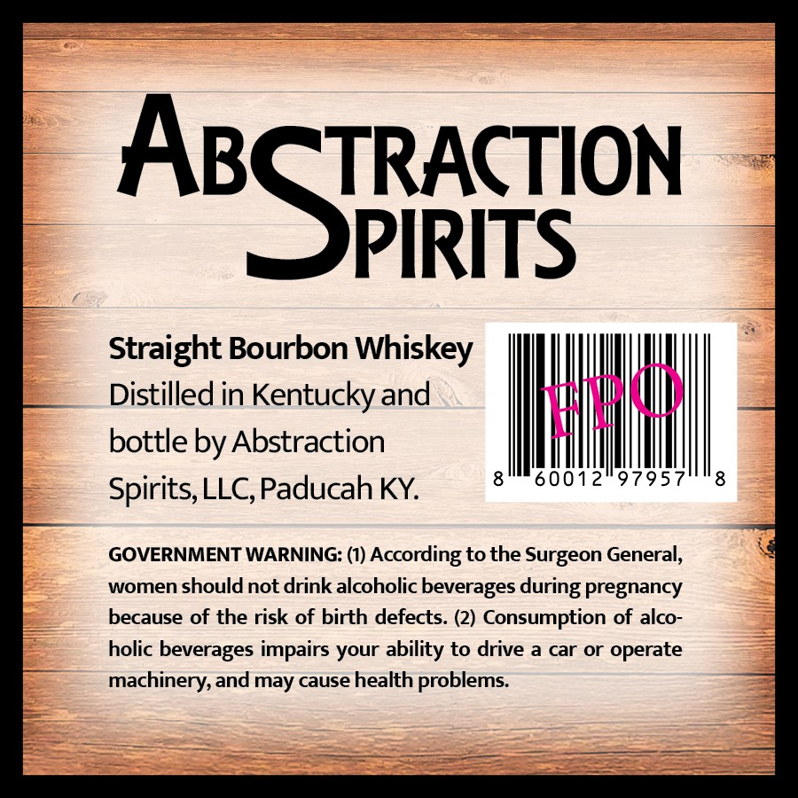
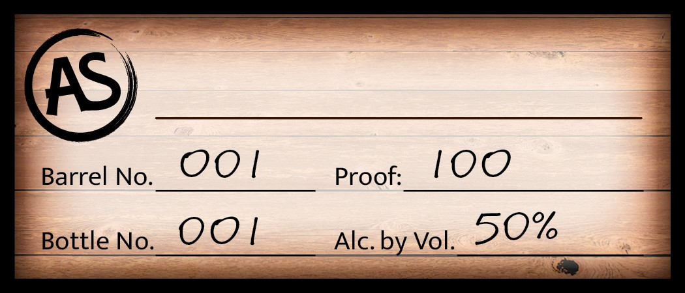

# TTB COLA Label Images - TTBID 26141001001058

**Brand Name:** ABSTRACTION SPIRITS

**Fanciful Name:** SINGLE BARREL

**Issue Date:** 05/28/2026

**Origin Code:** 22

**Product Class/Type:** 101

**Source:** [TTB Public COLA Registry](https://ttbonline.gov/colasonline/viewColaDetails.do?action=publicFormDisplay&ttbid=26141001001058)

## Label Images

### Back Label

### Front Label

## Extracted Label Text

*Text extracted via OCR - may contain errors*

### Back Label

ABCIRACTION
PIRITS

Straight Bourbon Whiskey
Distilled in Kentucky and
bottle by Abstraction

8

Spirits, LLC, Paducah KY. 600127950

GOVERNMENT WARNING: (1) According to the Surgeon General,
women should not drink alcoholic beverages during pregnancy
because of the risk of birth defects. (2) Consumption of alco-
holic beverages impairs your ability to drive a car or operate
machinery, and may cause health problems.

8

### Front Label

—

eS

Barrel No.

OO!

Proof:

ROXe;

Bottle No.

nee

plat vol
