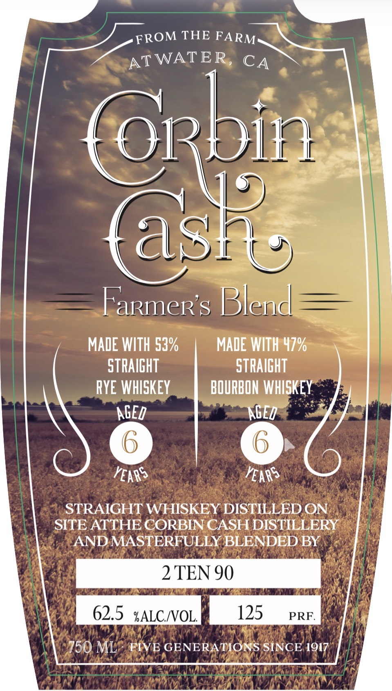
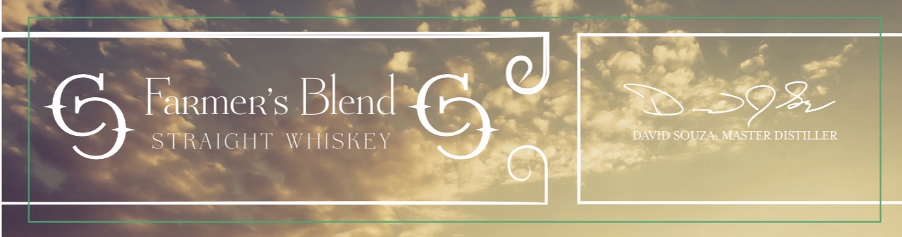
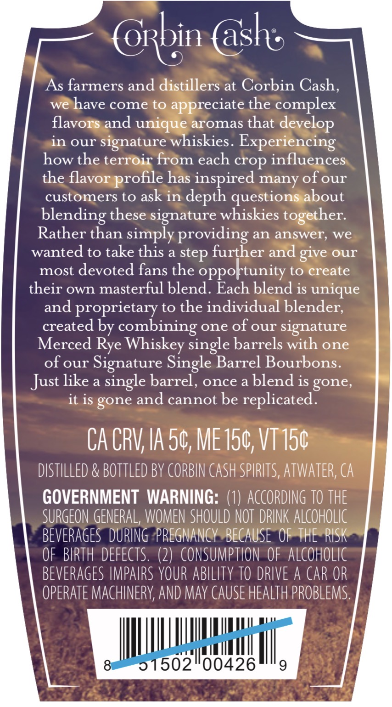

# TTB COLA Label Images - TTBID 26141001001067

**Brand Name:** CORBIN CASH

**Issue Date:** 06/17/2026

**Origin Code:** 01

**Product Class/Type:** 109

**Source:** [TTB Public COLA Registry](https://ttbonline.gov/colasonline/viewColaDetails.do?action=publicFormDisplay&ttbid=26141001001067)

## Label Images

### Label 1

### Label 2

### Label 3

## Extracted Label Text

*Text extracted via OCR - may contain errors*

**Detected Proof:** 125

### Label 1

THE
AT WATER
(ash
Farmer s Blend
MADE WITH 53%
MADE WITH 47%
STRAIGHT
STRAIGHT
RYE WHISKEY
BOURBON WHISKEY
AGED
AGED
YEARS
YEARS
STRAIGHT WHISKEY DISTILLED ON
SITE ATTHE CORBIN CASH DISTILLERY
AND MASTERFULLY BLENDED BY
2 TEN 90
62.5
%ALC /OL;
125
PRF
750 ML
FIVE GENERATIONS SINCE 1917
FROM
FARM
CA
(@rbin

### Label 2

0
FarmeR s Blend
2398,
DAVID SOUZ AMLASTER DISTILLER
STRAIGHT WHISKEY

### Label 3

@xbin @aske
As farmers and distillers at Corbin Cash,
we have come to
appreciate the complex
flavors and
aromas that
in our
signature whiskies. Experiencing
how the terroir from each crop influences
the flavor
has inspired many of our
customers to ask in
depth questions about
blending these signature whiskies together:
Rather than simply providing an answer;
we
wanted to take this a step further and give our
most devoted fans the oppoktunity to create
their own masterful blend. Each blend is unique
and proprietary to the individual blender;
created by combining one of our signature
Merced Rye Whiskey single barrels with one
of our
Signature Single Barrel Bourbons:
Just like a single barrel, once a blend is gone,
it is gone and cannot be replicated_
CA CRV IA 50, ME 150, VT 150
distILLED & BOTTLEd BY CORBIN CaSh SPIRITS, ATWATER; Ca
GOVERNMENT  WARNING: (1) ACcORDING TO THE
SURGEON GENERAL, WOMEN SHOULD NOT  DRINK ALCOHOLIC
BEVERAGES  DURING  PREGNANCY BECAUSe OF THE RISK
OF BIRTH  dEfects: (2)   CONSUMPTION OF  alcoholic
BEVERAGES IMPARS YOUR ABILITY TO DRIVE A CAR OR
opeRATe MACHINERV; AND May CauSe heaLTh PROBLEMS.
31502
00426
9
develop
unique
profile
