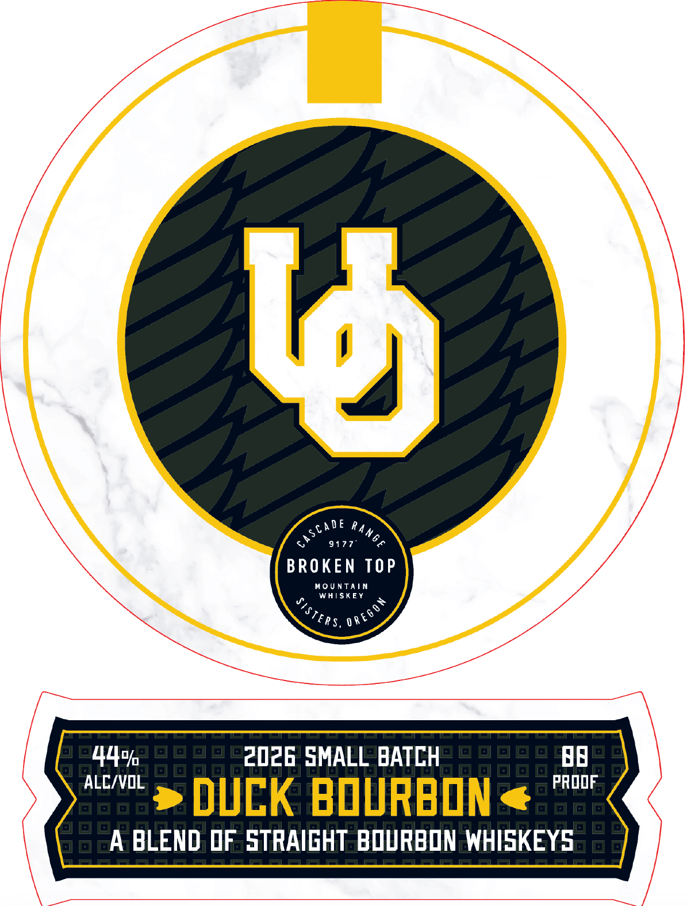
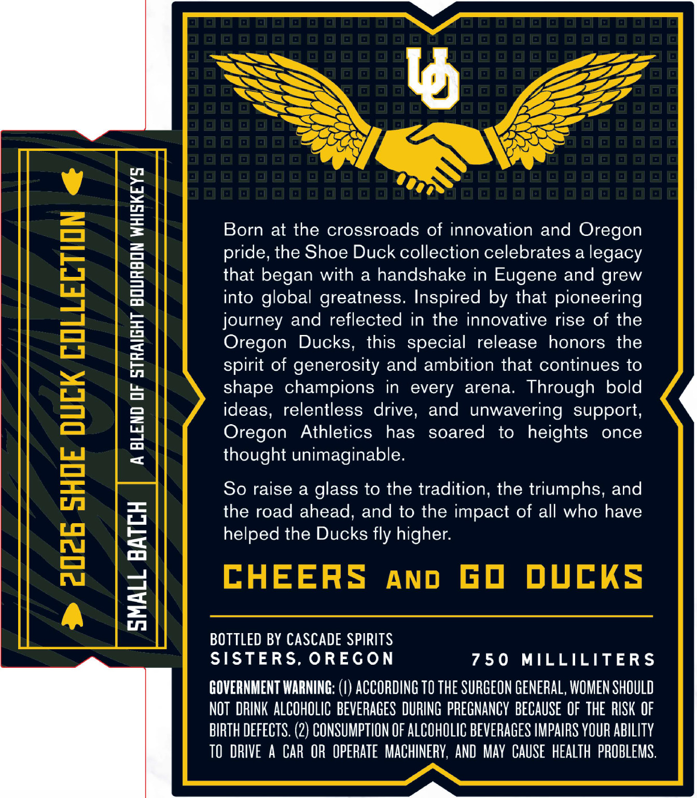

# TTB COLA Label Images - TTBID 26142001000180

**Brand Name:** BROKEN TOP

**Issue Date:** 05/28/2026

**Origin Code:** 38

**Product Class/Type:** 121

**Source:** [TTB Public COLA Registry](https://ttbonline.gov/colasonline/viewColaDetails.do?action=publicFormDisplay&ttbid=26142001000180)

## Label Images

### Label 1

### Label 2

## Extracted Label Text

*Text extracted via OCR - may contain errors*

### Label 1

MOE Ray

BROKEN TOP

MOUNTAIN

WHISKEY

Eps, one

Ay,

2026 SMALL BATCH

ah

-~ >» DUEK BOURBON<« PROOF

A BLEND OF STRAIGHT BOURBON WHISKEYS

### Label 2

~=l

<-e

SSS

Ss

aT

See

>

Born at the crossroads of innovation and Oregon

pride, the Shoe Duck collection celebrates a legacy

that began with a handshake in Eugene and grew

into global greatness. Inspired by that pioneering

journey and reflected in the innovative rise of the

Oregon Ducks, this special release honors the

spirit of generosity and ambition that continues to

shape champions in every arena. Through bold

ideas, relentless drive, and unwavering support,

Oregon Athletics has soared to heights once

thought unimaginable.

So raise a glass to the tradition, the triumphs, and

the road ahead, and to the impact of all who have

helped the Ducks fly higher.

CHEERS ano GO DUCKS

BOTTLED BY CASCADE SPIRITS

SISTERS, OREGON

750 MILLILITERS

GOVERNMENT WARNING: (!) ACCORDING TO THE SURGEON GENERAL, WOMEN SHOULD

NOT DRINK ALCOHOLIC BEVERAGES DURING PREGNANCY BECAUSE OF THE RISK OF

BIRTH DEFECTS. (2) CONSUMPTION OF ALCOHOLIC BEVERAGES IMPAIRS YOUR ABILITY

TO DRIVE A CAR OR OPERATE MACHINERY, AND MAY CAUSE HEALTH PROBLEMS.
