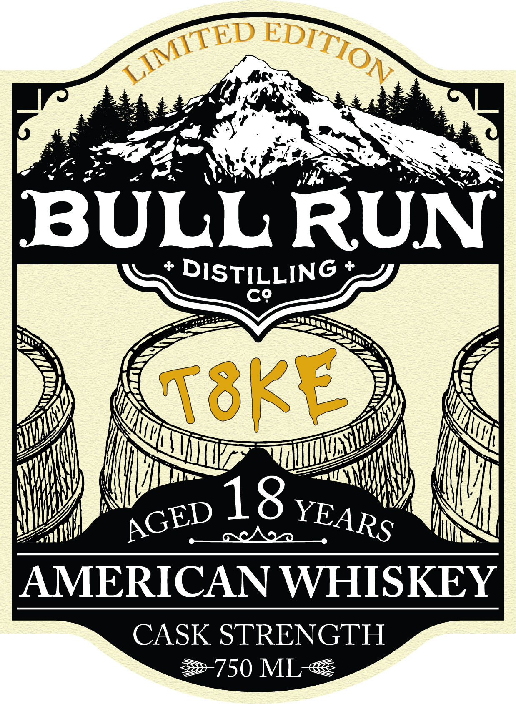
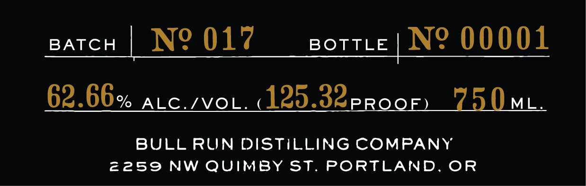
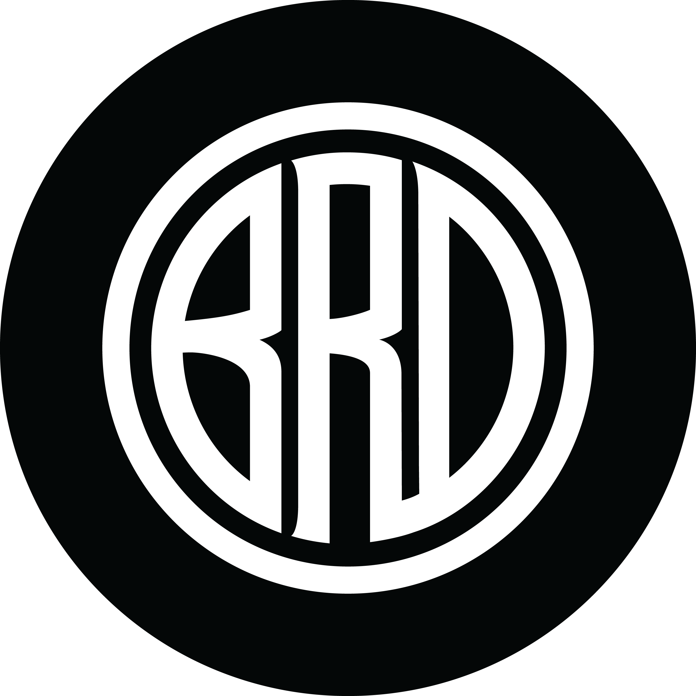
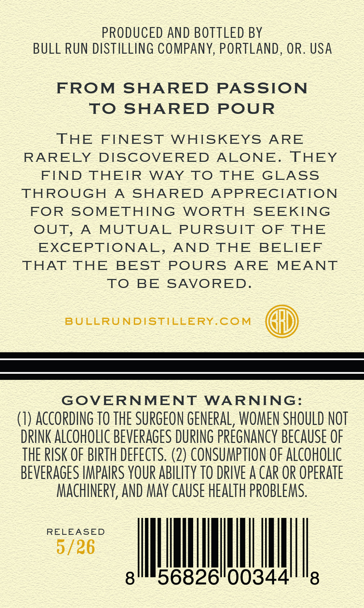

# TTB COLA Label Images - TTBID 26142001000299

**Brand Name:** BULL RUN DISTILLING CO

**Fanciful Name:** T8KE

**Issue Date:** 06/01/2026

**Origin Code:** 38

**Product Class/Type:** 140

**Source:** [TTB Public COLA Registry](https://ttbonline.gov/colasonline/viewColaDetails.do?action=publicFormDisplay&ttbid=26142001000299)

## Label Images

### Label 1

### Label 2

### Label 3

### Label 4

## Extracted Label Text

*Text extracted via OCR - may contain errors*

*1 image(s) excluded: text did not meet readability threshold*

**Detected Proof:** 125.3

### Label 1

BULL RUN
DISTILLING
C9
TeKL
18
AMERICAN WHISKEY
CASK STRENGTH
750 ML
LIMITED
EDITION
dTB
AGED
YEARS

### Label 2

BATCH
No 017
BOTTLE
No 00001
62.66%
ALC IVOL
12532PROQE)
750mL
BULL RUN DISTILLING COMPANY
2259
NW QUIMBY St.
PORTLAND. OR

### Label 4

PRODUCED AND BOTTLED BY
BULL RUN DISTILLING COMPANY, PORTLAND , OR. USA
FROM
SHARED
PASSION
TO
SHARED
POUR
THE
FINEST
WHISKEYS
ARE
RARELY
DISCOVERED
ALONE.
THEY
FIND THEIR
WAY
To
THE
GLAss
THROUGH
A
SHARED
APPRECIATION
FOR
SOMETHING
WORTH
SEEKING
OUT,
A
MUTUAL
PURSUIT
OF
THE
EXCEPTIONAL,
AND
THE
BELIEF
THAT
THE
BEST
POURS
ARE
MEANT
TO
BE
SAVORED
BULLRUNDISTILLERY.COM
GOVERNMENT
WARNING:
(7) ACcORding TO THE SURGEON GENERAL, WOMEN SHOULD NOT
DRINK ALCOHOLIC BEVERAGES DURING PREGNANCY BECAUSE OF
THE RISK OF BIRTH defEcts: (2) CONSUMPTION OF ALCOHOLIC
BEVERAGES IMPAIRS YOUR ABILITY TO DRIVE A CaR OR OPERATE
MAChINERY, AND MaY CauSe HEALTH PROBLEMS:
RELEASED
5/26
8
56826"00344'
8
