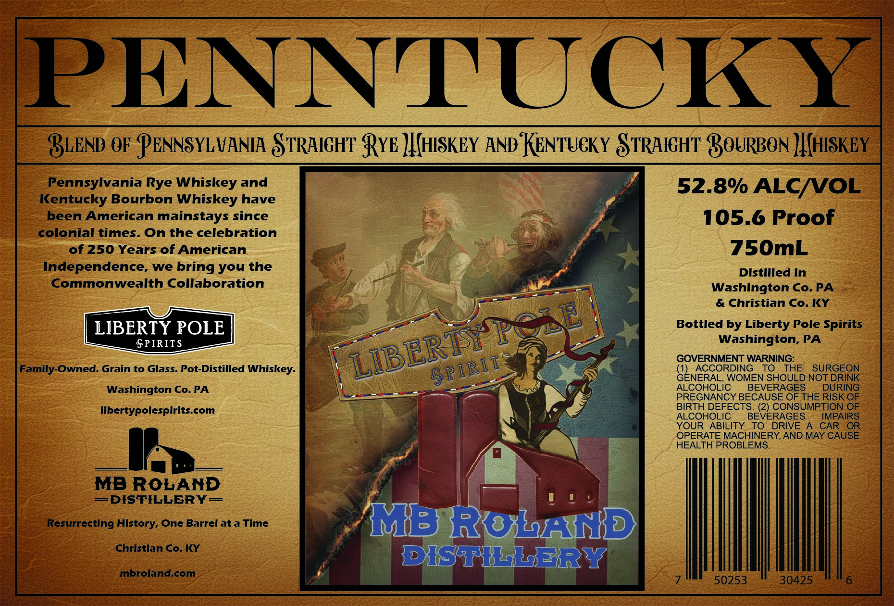

# TTB COLA Label Images - TTBID 26142001000300

**Brand Name:** PENNTUCKY

**Issue Date:** 05/29/2026

**Origin Code:** 39

**Product Class/Type:** 129

**Source:** [TTB Public COLA Registry](https://ttbonline.gov/colasonline/viewColaDetails.do?action=publicFormDisplay&ttbid=26142001000300)

## Label Images

### Label 1

## Extracted Label Text

*Text extracted via OCR - may contain errors*

**Detected Proof:** 105.6

### Label 1

PENNTUCKY
BLEND OF PENNSYLVANIA STRAIGHT' RYE JIHISKEY AND KENTUGKY STRAIGHT' BOuRBON JIHISKEY
Pennsylvania Rye Whiskey and
52.8% ALC/VOL
Kentucky Bourbon Whiskey have
been American mainstays since
105.6 Proof
colonial times. On the celebration
of 250 Years of American
750mL
Independence, we
you the
Distilled in
Commonwealth Collaboration
Washington Co. PA
& Christian Co.KY
Bottled by Liberty Pole Spirits
Washington, PA
GOVERNMENT WARNING:
Family-Owned: Grain to Glass. Pot-Distilled Whiskey_
ACCORDING
To
THE
SURGEON
GENERAL, WOMEN SHOULD NOT DRINK
Washington Co. PA
ALCOHOLic
BEVERAGES
DURING
PREGNANCY BECAUSE OF THE RISK OF
libertypolespirits com
BIRTH DEFECTS. (2) CONSUMPTION OF
ALCOHOLIC
BEVERAGES
IMPAIRS
YOUR
ABILITY
To
DRIVE
CAR
OR
OPERATE MACHINERY,AND MAY CAUSE
HEALTH PROBLEMS
MB ROLAND
=DISTILLERY
Resurrecting History, One Barrel at a Time
MBrobAUBD
Christian Co. KY
DXSSHHakRRY
mbroland.com
50253
30425
bring
Peze
LIBERPY
$PIRIT
