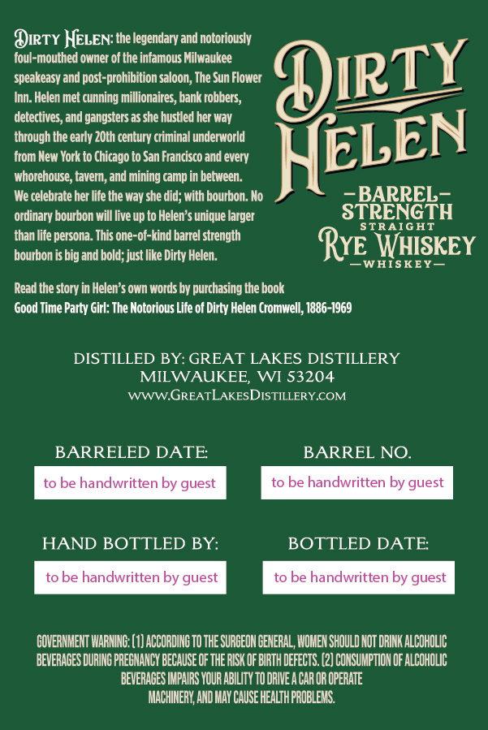
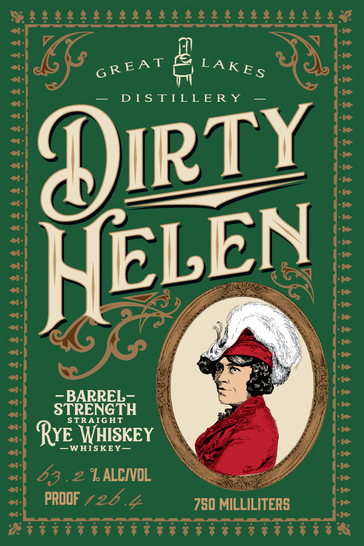

# TTB COLA Label Images - TTBID 26142001000356

**Brand Name:** DIRTY HELEN

**Issue Date:** 06/02/2026

**Origin Code:** 48

**Product Class/Type:** 102

**Source:** [TTB Public COLA Registry](https://ttbonline.gov/colasonline/viewColaDetails.do?action=publicFormDisplay&ttbid=26142001000356)

## Label Images

### Back Label

### Front Label

## Extracted Label Text

*Text extracted via OCR - may contain errors*

### Back Label

Oirtr HELEN: the legendary and notoriously
foul-mouthed owner of the infamous Milwaukee
speakeasy and post-prohibition saloon, The Sun Flower
OTY
Inn. Helen met cunning millionaires; bank robbers,
detectives, and gangsters as she hustled her Way
through the early ZOth century criminal underworld
from New York to Chicago to San Francisco and every
HELEN
whorehouse, tavern, and mining (amp in between.
We celebrate her life the way she did; with bourbon. Ho
BARREL _
ordinary bourbon will live up to Helen'$ unique larger
STRENGTH
STRAIGAT
than life persona. This one-of-kind barrel strength
bourbon is big and bold; just like Dirty Helen.
RyE WHISKEY
WHISKEY
Read the story in Helen'$ own words by purchasing the book
Good Time Party Girl: The Notorious Life of Dirty Helen Cromwell, 1886-1969
DISTILLED BY: GREAT LAKES DISTILLERY
MILWAUKEE_
WI 53204
WWWGREATLAKESDISTILLERYCOM
BARRELED DATE
BARREL NO.
to be handwritten by guest
to be handwritten by guest
HAND BOTTLED BY:
BOTTLED DATE
to be handwritten by guest
to be handwritten by guest
GOVERNMEHT WARNNG: (1] ACCORDING TO THE SURCEOH CENERAL, WOHEN ShHOULD NOT DRINK ALCOHOLIc
BEVERAGES DURING PREGHANCY BECAUSE OF the RISK DF BIRTH DEFECTS. (2] CONSUMPTION DF ALCOHOLIC
BEVERACES IMPARS YOUR ABILTY TO DRIVEA CAR OR OpeRATe
MACHINERY ANd ay Cause HEALTh FROBLEMS

### Front Label

eee é TAKES

— DISTILLERY —

TY

HELE

STRENGTH

—BARREL—

STRAIGHT

RYE WHISKEY

—WHISKEY—

mes

2

‘7. ALCIVOL

PROOF

750 MILLILITERS
