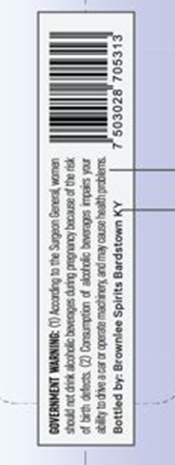
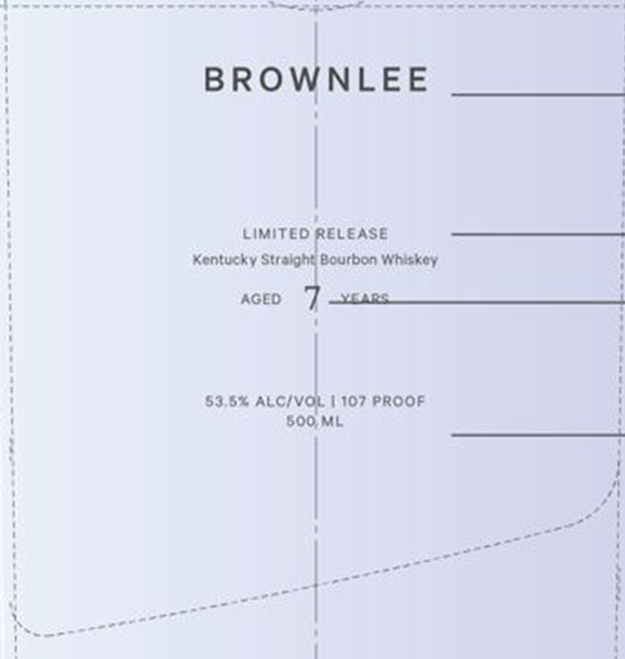

# TTB COLA Label Images - TTBID 26142001000402

**Brand Name:** BROWNLEE

**Issue Date:** 05/28/2026

**Origin Code:** 22

**Product Class/Type:** 101

**Source:** [TTB Public COLA Registry](https://ttbonline.gov/colasonline/viewColaDetails.do?action=publicFormDisplay&ttbid=26142001000402)

## Label Images

### Back Label

### Label 1

## Extracted Label Text

*Text extracted via OCR - may contain errors*

**Detected Proof:** 107.2

### Back Label

\
iil ZOE0S s b
1 Be 3:
|| URGCMA YesRUR UOREINS a4 CE GUUEOY (|) “ONIN LNIMNEIACS

### Label 1

9S SS OOS Re ee ar,

ues:

oor ee

ati het

a acacnhcatn be ttienhen doe

BRO Ilo =

LIMITED RELEASE

Kentucky Str:

Bourbon Whiskey

AGEO

53.6% ALC/V!

1107 PROOF

500,ML

al

a

ene

--

pocorn

Saore

----"

aos"

oor

~—-"

----"
