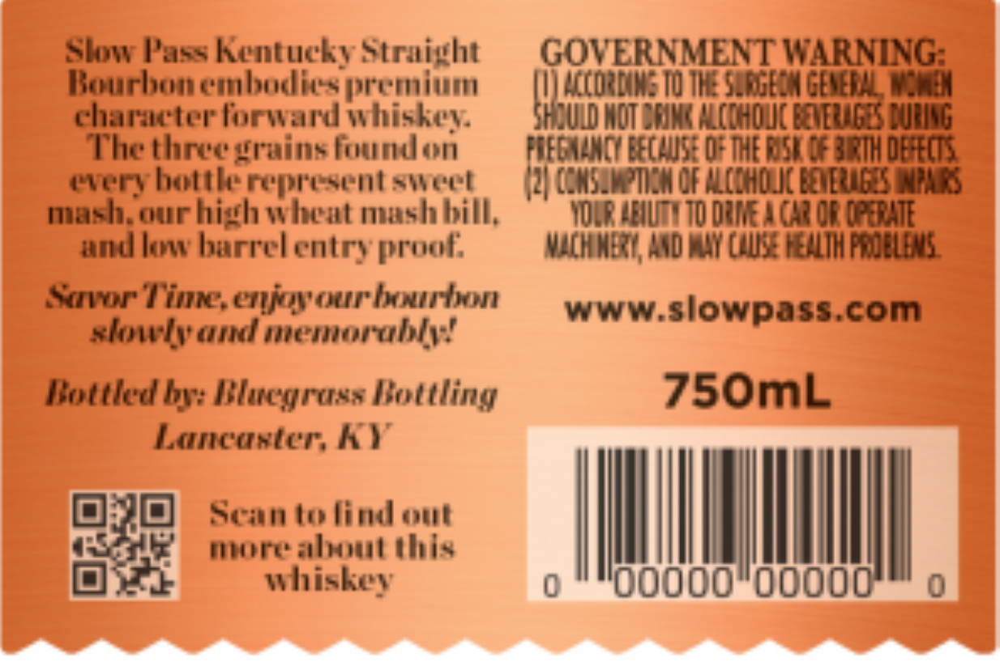
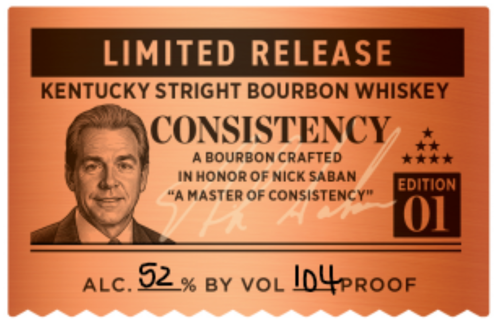

# TTB COLA Label Images - TTBID 26142001000500

**Brand Name:** CONSISTENCY LIMITED RELEASE

**Issue Date:** 05/30/2026

**Origin Code:** 22

**Product Class/Type:** 101

**Source:** [TTB Public COLA Registry](https://ttbonline.gov/colasonline/viewColaDetails.do?action=publicFormDisplay&ttbid=26142001000500)

## Label Images

### Back Label

### Front Label

## Extracted Label Text

*Text extracted via OCR - may contain errors*

### Back Label

Slow Pass Kentucky Straight GOVERNMENT WARNING:
Bourbon embodies premium ! ACCORDING TO THE SURGEOM Be
character forward whiskey. WOT DRINK ALCOHOLIC DUENG
The three grains foundon FGNANCY BECAUSE OF THE ROSH OF SIRTH DEFECTS.
every bottle represent sweet (2) CONSUMPTION OF ALCOHOLIC BEVERAGES PAS
mash, our high wheat mash bill, YOUR ABILITY 10 DRIVE A CAR OF OPERATE
and low barrel entry proof. MACHINERY, AND MAY COUSE HEALTH PROBLEMS.
Savor Time, enjoy our bourbon
and memorably! www.slowpass.com
Bottled by: Bluegrass Bottling 750mL
Lancaster, hY
Sek more about this
| whiskey o “"O0000"0000 0

### Front Label

LIMITED RELEASE
KENTUCKY STRIGHT BOURBON WHISKEY
BA CONSISTENCY +
A BOURBON CRAFTED rae
IN HONOR OF NICK SABAN EDITION
; “A MASTER OF CONSISTENCY”
ALC. 02 % BY VOL InUsroor
