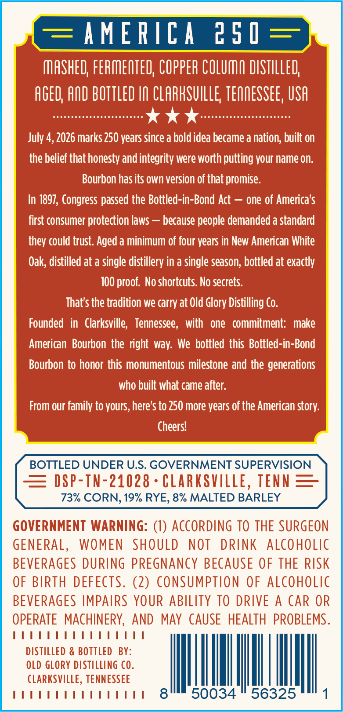
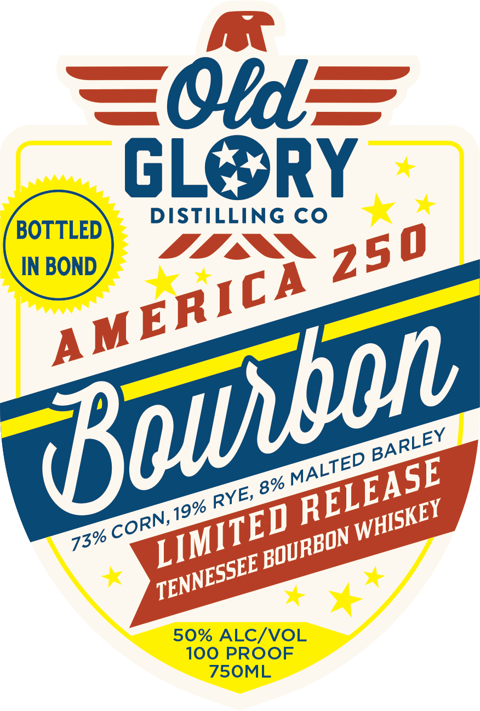

# TTB COLA Label Images - TTBID 26142001000537

**Brand Name:** AMERICA 250

**Issue Date:** 06/01/2026

**Origin Code:** 43

**Product Class/Type:** 111

**Source:** [TTB Public COLA Registry](https://ttbonline.gov/colasonline/viewColaDetails.do?action=publicFormDisplay&ttbid=26142001000537)

## Label Images

### Back Label

### Front Label

## Extracted Label Text

*Text extracted via OCR - may contain errors*

**Detected Proof:** 100

### Back Label

AMERICA
2 5 0
MASHED; FERMEOTED; COPPER COLUMO DISTILLED
AGED; AQD BOTTLED I0 CLARHSVILLE TEQQESSEE, USA
July 4, 2026 marks 250 years since a bold idea became a nation; built on
the belief that honesty and integrity were worth putting your name on:
Bourbon hasits own version of that promise:
In 1897, Congress passed the Bottled-in-Bond Act
one of America'$
first consumer protection laws =
because people demanded a standard
they could trust. Aged a minimum of four years in New American White
Oak, distilled at a single distillery in a single season, bottled at exactly
100 proof. No shortcuts. No secrets:
That's the tradition we carry at Old Glory Distilling Co.
Founded  in   Clarksville;   Tennessee ,  with   one   commitment:   make
American  Bourbon the right way: We bottled this Bottled-in-Bond
Bourbon to honor this monumentous milestone and the generations
who built what came after:
From our family to yours, here's to 250 more years of the American story:
Cheers?
BOTTLED UNDER U.S. GOVERNMENT SUPERVISION
DSP-TN-21028
CLARKSVILLe,
TENN
73% CORN, 19% RYE, 8% MALTED BARLEY
GOVERNMENT WARNING: (1) ACCORDING TO THE SURGEON
GENERAL,
WOMEN
SHOULD
NOT
DRINK
ALcoholic
BEVERAGES DURING PREGNANCY BECAUSE OF THE RiSk
OF BIRTH
DEFECTS. (2) Consumption
OF ALCoholic
BEVERAGES IMPAIRS YOUR ABILITY TO DRIVE
A
CAR OR
OPERATE   MACHINERY, AND
MAY CAUSE HEALTH PROBLEMS .
DISTILLed & BOTTLED BY:
OLD GLORY diStiLLING C0.
CLARKSVILLE, TENNESSEE
8
50034
56325

### Front Label

=oid
GL
RY
DISTILLING CO
BOTTLED
IN BOND
50% ALC/VOL
100 PROOF
75OML
250
AMERICA
(olbon
BARLEY
MALTED
RELEASE
8%
RYE,
19%
WHISKEY
LIMITED
CORN,
'BOURBON
73%
TENNESSEE _
