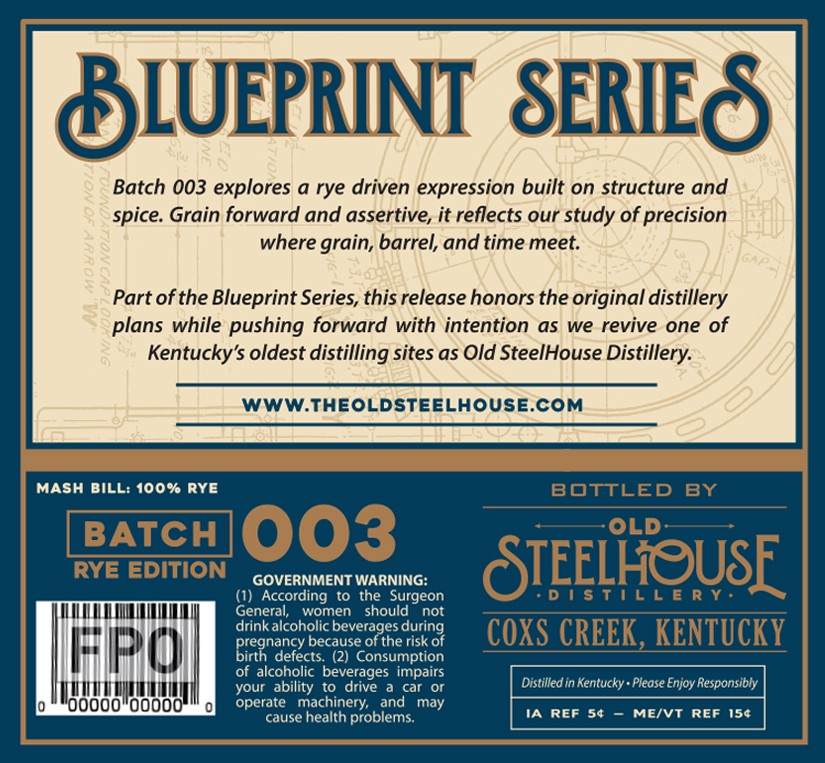

# TTB COLA Label Images - TTBID 26142001000570

**Brand Name:** BLUEPRINT SERIES BATCH 003

**Issue Date:** 06/02/2026

**Origin Code:** 22

**Product Class/Type:** 102

**Source:** [TTB Public COLA Registry](https://ttbonline.gov/colasonline/viewColaDetails.do?action=publicFormDisplay&ttbid=26142001000570)

## Label Images

### Back Label

### Front Label

## Extracted Label Text

*Text extracted via OCR - may contain errors*

### Back Label

SLUEPRINT  SERIES
8
Batch 003 explores a rye driven expression built on structure and
spice: Grain forward and assertive, it reflects our study of precision
where grain, barrel, and time meet:
Partofthe Blueprint Series, this release honors the original distillery
plans while pushing forward with intention as we revive one of
Kentucky's oldest distilling sites as Old SteelHouse Distillery:
WWW.THEOLDSTEELHOUSE.COM
MaSH BILL: 100% RYE
BOTTLED
BY
BATCH
003
OLD
RYE EDITION
GOVERNMENT WARNING:
STEELHOUSF
(1) According
to the Surgeon
D !
General;
women
should
not
dregralcoholec beseageedurro
COXS CREEK, KENTUCKY
FIRCO
Diegnaefe
defects:
Consumption
of alcoholic beverages impairs
your ability
drive
car
Distilled in Kentucky . Please Enjoy Responsibly
00o"OoooO
operate   machinery;
and
may
cause health problems:
REF
MEIVT
REF
154

### Front Label

|

ea\ol\ S|

ASAD

f

Ht}

ew

ff

Hy

Wy

y

iif

4

if

yf

i)

py)

if

»

‘aeaal

L_/

fi

lt A

PRYASS oh i, sl

eo Lees

it

li

A

CAN ——ae

a

Yo

waco woe

BEHO cadena

we® Aso yd berwost

ABE Loo Horvoe@

D-DAY BAGAAA WAAL SENTONNIEN RO WAL aed,

Brn

V

HI

Wd vad

YAS

BST)

=)

=

aj i}

i)

2 wads WAM

|

i)

es Sed!

fey I]

]

Vy

i

ZB aha zo Z3g0\9

y,

© AAAS WELO

V/

Wy

NI

i

an

Hig

i

Hid

:

Sword

i |

)

Hi

i

i

)

t

= ——

a

f

—

—

|r

aohe

wraktd

me

Yakos

i

il

4

9

iit di

BSG

SS

i

— yor

Ss

WAS DB Soaht VG PmorsU

!

AZRS GEA

Rassat

Sod, WARD YaRd =O DORATINO

in
