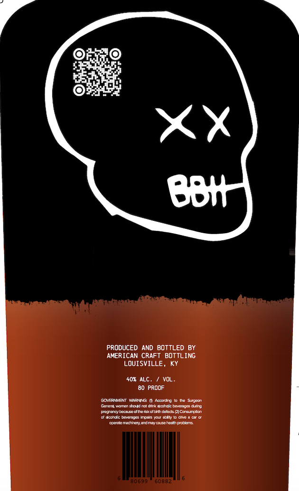
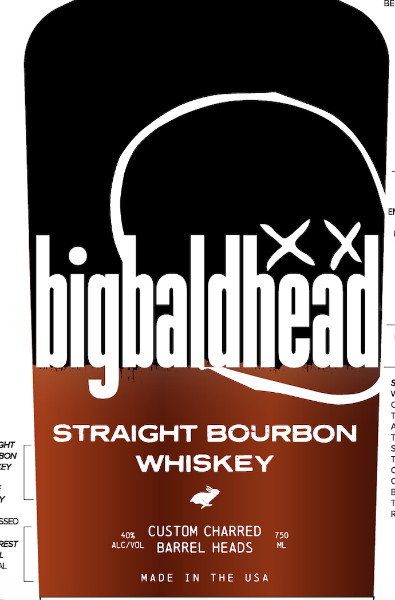

# TTB COLA Label Images - TTBID 26142001000625

**Brand Name:** BIGBALDHEAD

**Issue Date:** 06/16/2026

**Origin Code:** 22

**Product Class/Type:** 101

**Source:** [TTB Public COLA Registry](https://ttbonline.gov/colasonline/viewColaDetails.do?action=publicFormDisplay&ttbid=26142001000625)

## Label Images

### Back Label

### Front Label

## Extracted Label Text

*Text extracted via OCR - may contain errors*

**Detected Proof:** 80

### Back Label

BBtt
PRODUCED AND BOTTLED BY
AMERICAN CRAFT BOTTLING
LOUISVILLE _
407 ALC.
VOL
80 PROOF
GOveRNMAT Vinata
Agetn
Sur
Guetvenndeunsdtkdelak beiedt9
pieguancyeerecoddenecoleiih deete 2ICoeteken
Acondk banesncdn You Eiy
dinve
Odedemann aymey clse heeino odent
30699
60882

### Front Label

Figballiu
STRAIGHT BOURBON
GHT
BON
EY
WHISKEY
SSED
405
CUSTOM CHARRED
750
REST
ALC/VOL
BARREL HEADS
MADE
In
THE
U$ A
