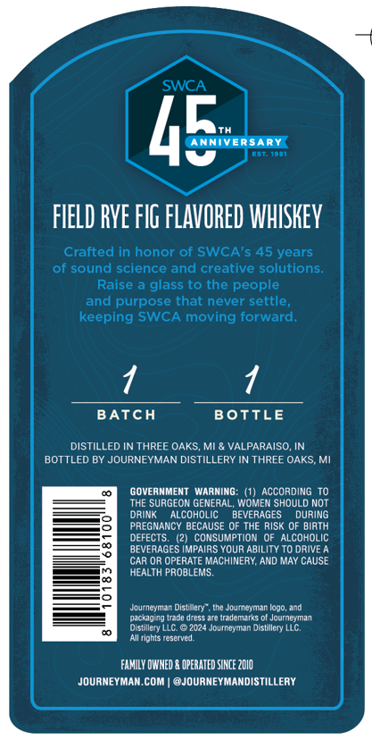
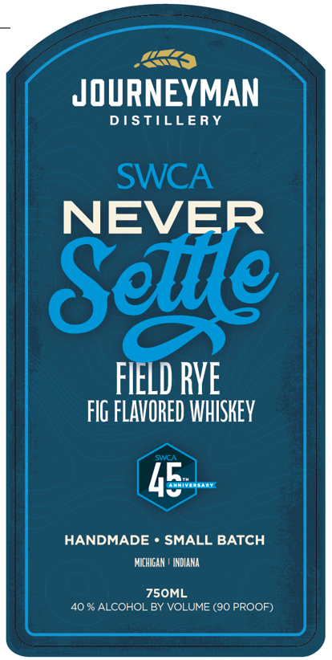

# TTB COLA Label Images - TTBID 26142001000638

**Brand Name:** JOURNEYMAN DISTILLERY

**Fanciful Name:** SWCA NEVER SETTLE FIELD RYE

**Issue Date:** 06/04/2026

**Origin Code:** 06

**Product Class/Type:** 149

**Source:** [TTB Public COLA Registry](https://ttbonline.gov/colasonline/viewColaDetails.do?action=publicFormDisplay&ttbid=26142001000638)

## Label Images

### Back Label

### Front Label

## Extracted Label Text

*Text extracted via OCR - may contain errors*

**Detected Proof:** 80
**Detected Age:** 45 Years

### Back Label

SWCA
4E
ANNTHERSARY
GSa 1901
FIELD RVE FlG FLAVORED WHISKEY
Crafted in honor of SWCA's 45 years
of sound science and creative solutions
Raise a glass to the people
and purpose that never settle
keeping SWCA moving forward
BATCH
BOTTLE
DISTILLED IN THREE OAKS, MI & VALPARAISO; IN
BOTTLED BY JOURNEYMAN DISTILLERY IN THREE OAKS; MI
GOVERNMENT WARNING: (1)
ACCORDING TO
THE SURGEON GENERAL, WOMEN SHOULD NOT
DRINK
alcohulic
BEVERAGES
DURING
PREGNANCY BECAUSE OF THE RISK OF BIRTH
DEFECTS.
CONSUMPTION
OF AlcohOLiC
BEVERAGES IMPAIRS YOUR ABILITY TO DRIVE
CaR OR OPERATE MACHINERY; AND MAY CAUSE
HEALTH PROBLEMS_
Jovineyman Distillery , the Jouineyman Iogo, and
acraqino Wade (ies5 31eUravemzis
JourneyMan
Oistllery LLC:
'2024 Jouineyrtan
Disbllery LLC.
AIl tiphts reserved-
FAMILY OHHED =
OPERATEd SINCE Z01O
JOURNEYMAN.COM
@JOURNEYMANDISTILLERY

### Front Label

JOURNEYMAN
D ISTILLERY
SWCA
NEVER
Selile
FIELD RVE
FIG FLAVORED WHISKEY
5
HANDMADE
SMALL BATCH
MICHIGAN ! INDIANA
ZSOML
40 % ALCOHOL BY VOLUME (90 PROOF)
