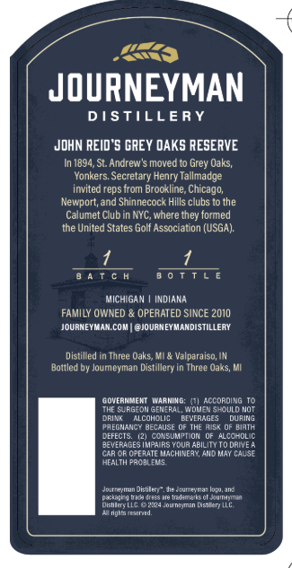
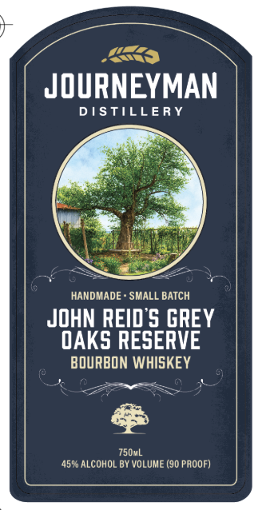

# TTB COLA Label Images - TTBID 26142001000646

**Brand Name:** JOURNEYMAN DISTILLERY

**Fanciful Name:** JOHN REID'S GREY OAKS RESERVE BOURBON WHISKEY

**Issue Date:** 05/29/2026

**Origin Code:** 06

**Product Class/Type:** 141

**Source:** [TTB Public COLA Registry](https://ttbonline.gov/colasonline/viewColaDetails.do?action=publicFormDisplay&ttbid=26142001000646)

## Label Images

### Back Label

### Front Label

## Extracted Label Text

*Text extracted via OCR - may contain errors*

### Back Label

JOURNEYMAN
DSTILLERY
JDHN REID 5 GREY DAKS RESERVE
In 1894, St Andrew $ moved to
Uaks;
Yonkers Secretary Henry Tallmadge
invited reps from Brockline
Newport;and Shinnecock Hills clubs t0 the
Calumet Club in NYC, where they formed
the United States Golf Association (USGA)
8 4 T c
0 0 T T L E
MICHIGAN
indiana
FAMILY OWNED
OPERATED SINCE 2010
JOURMEYMAN coM
@JourNEYMANDISTILLERY
Distilled
Turee Qaks;MIe
Valparaiso,IM
Baltled by Joumeyman Distillery
Three Qaks; MI
GovfaNLFM
MaaMING-
According To
ThF Surgeom GeNeral, Women Should Not
DRINk
alcohclic
BeverAGES
duRING
PAEGNANC'
BECAUSE
ThE Aisk
BIATH
DEFECIs
GonsumipMON
ALtchole
Jevephaesixipairs y Wur Abilii
WreaoiemachiceanaMnL
Mo DRASE
Ecm
Hmeeentetnult-le
Cutmetae mete
padal Dadadrde :Ji0 Isdema teol oumemtan
Drhlcne MG"aJolmaaMan Kaitr c
enmicnFmnd
Grey =
Chicago;

### Front Label

JOURNEYMAN
DSTILLERY
HANDMADE
SMALL BATCH
JohN REID'S GREY
OAKS RESERVE
BOURBON WHISKEY
750mL
459 ALCOHOL BY VOLUME (90 PAOOF)
