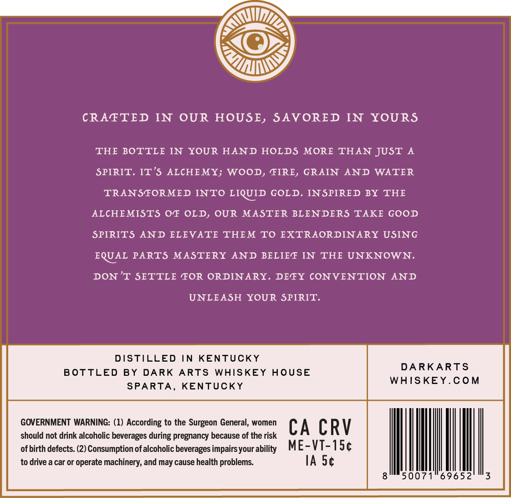
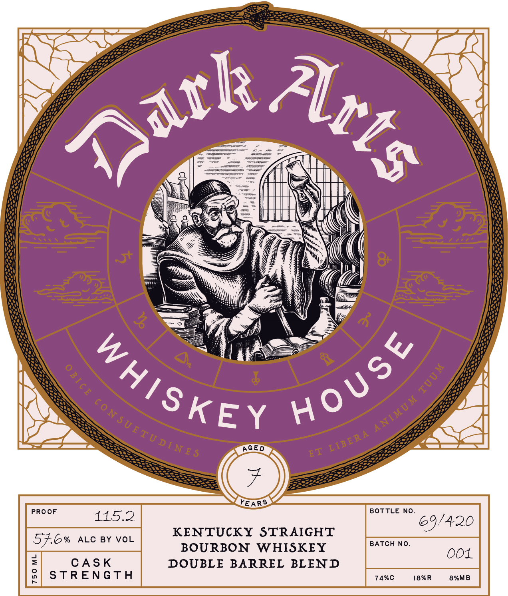
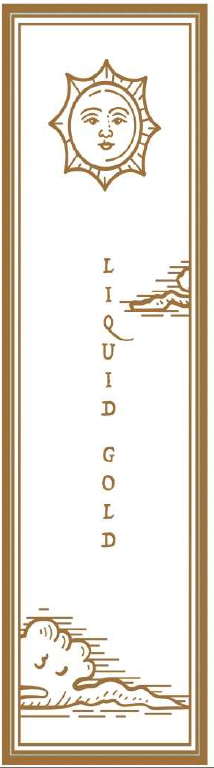

# TTB COLA Label Images - TTBID 26142001000674

**Brand Name:** DARK ARTS WHISKEY HOUSE

**Issue Date:** 06/03/2026

**Origin Code:** 22

**Product Class/Type:** 101

**Source:** [TTB Public COLA Registry](https://ttbonline.gov/colasonline/viewColaDetails.do?action=publicFormDisplay&ttbid=26142001000674)

## Label Images

### Back Label

### Front Label

### Label 3

### Label 4

## Extracted Label Text

*Text extracted via OCR - may contain errors*

*2 image(s) excluded: text did not meet readability threshold*

**Detected Proof:** 115.2

### Back Label

CRAFTED IN OUR HOUSE, SAVORED
IN YOURS
THE BOTTLE IN YOUR HAND HOLDS MORE THAN JUST
SPIRIT. IT'$ ALCHEMY; WOOD, FIRE, GRAIN
AND
WATER
TRANSFORMED INTO LIQUID GOLD
INSPIRED BY THE
ALCHEMISTS OF OLD, OUR MASTER BLENDERS TAKE GOOD
SPIRITS AND ELEVATE THEM
TO EXTRAORDINARY USING
EQUAL PARTS
MASTERY
AND BELIEF IN
THE UNKNOWN.
DON 'T SETTLE FOR ORDINARY. DETY CONVENTION
AND
UNLEASH
YOUR SPIRIT.
DISTILLED
IN
KENTUCKY
DARKARTS
BOTTLED
BY
DARK
ARTS
WHISKEY
HoUsE
WAISKEY.Com
SPARTA _
KENTUCKY
GOVERNMENT WARNING: (1) According to the Surgeon General; women
CA CRV
should not drink alcoholic beverages
pregnancy because of the risk
of birth defects: (2) Consumption ofalcoholic beverages impairsyour ability
ME-VT-ISc
to drive a car or operate machinery; and may cause health problems:
IA Sc
50071
69652
during

### Front Label

~t
8
AGED
YE ARS
PRO OF
BOTTLE NO_
115.2
'420
KENTUCKY STRAIGHT
57.6%
ALC BY VOL
BATCH NO.
BOURBON
WHISKEY
001
3
CAS K
DOUBLE BARREL BLEND
9
S TREN GTH
74%C
18%R
8%MB
atk_
Arts
HoUSe
WhISKE{
E
9
ANIMU M
ConSUEIUDNE5
LIBERA
ET
