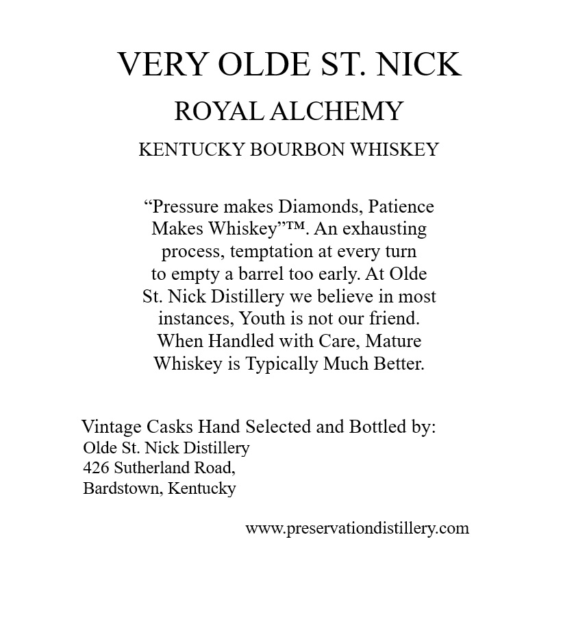
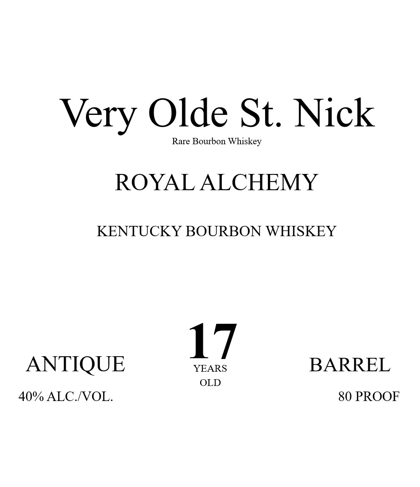
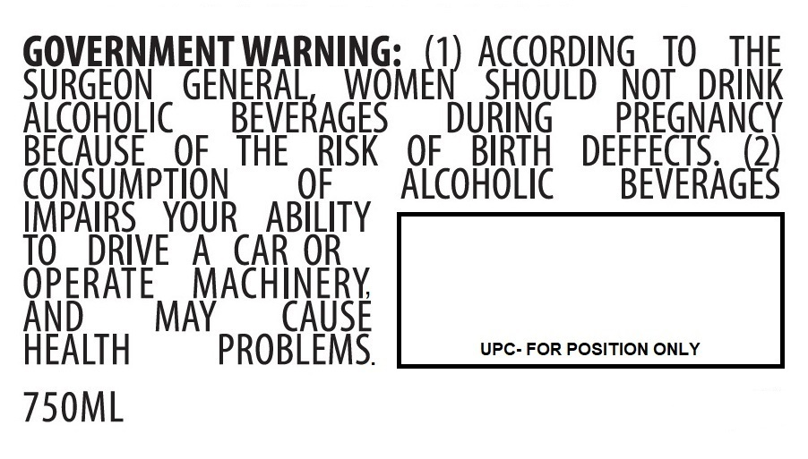

# TTB COLA Label Images - TTBID 26142001000734

**Brand Name:** VERY OLDE ST. NICK

**Issue Date:** 05/29/2026

**Origin Code:** 22

**Product Class/Type:** 101

**Source:** [TTB Public COLA Registry](https://ttbonline.gov/colasonline/viewColaDetails.do?action=publicFormDisplay&ttbid=26142001000734)

## Label Images

### Back Label

### Label 1

### Label 3

## Extracted Label Text

*Text extracted via OCR - may contain errors*

**Detected Proof:** 80

### Back Label

VERY OLDE ST NICK
ROYAL ALCHEMY
KENTUCKY BOURBON WHISKEY
~Pressure makes Diamonds, Patience
Makes Whiskey"TM. An exhausting
process, temptation at every turn
to empty
a barrel too early. At Olde
St. Nick Distillery we believe in most
instances, Youth is not our friend:
When Handled with Care, Mature
Whiskey is Typically Much Better:
Vintage Casks Hand Selected and Bottled by:
Olde St: Nick Distillery
426 Sutherland Road,
Bardstown; Kentucky
www preservationdistillerycom

### Label 1

Very Olde St: Nick
Rare Bourbon Whiskey
ROYAL ALCHEMY
KENTUCKY BOURBON WHISKEY
17
ANTIQUE
YEARS
BARREL
OLD
40%/ ALC NOL.
80 PROOF

### Label 3

GOVERNMENT WARNING:
ACCORDING
TO
THE
SURGEON
GENERAL
INGmeR) AGSORDH
NOT
DRINK
ALcOHOLic
BEVERAGES
DURiNG
PREGNANCY
BECAUSE
OF
THE
RISK
OF
BIRTH
DEFFECTS
CONSUMpTION
OF
Alcoholic
BEVERAGES
IMPAIRS
YOUR
ABILITY
TO
DRIVE
A
CAR OR
OPERATE
MACHINERK
ANd
MAY
CAUSE
HEALTH
PROBLEMS.
UPC- FOR POSITION ONLY
750ML
