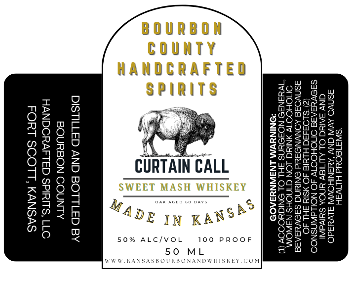

# TTB COLA Label Images - TTBID 26142001000804

**Brand Name:** BOURBON COUNTY HANDCRAFTED SPIRITS

**Fanciful Name:** CURTAIN CALL SWEET MASH WHISKEY

**Issue Date:** 05/28/2026

**Origin Code:** 21

**Product Class/Type:** 140

**Source:** [TTB Public COLA Registry](https://ttbonline.gov/colasonline/viewColaDetails.do?action=publicFormDisplay&ttbid=26142001000804)

## Label Images

### Label 1

## Extracted Label Text

*Text extracted via OCR - may contain errors*

**Detected Proof:** 100

### Label 1

BOURBON
COUNTY
HANDCRAFTED

JS w 2

So » S Zon w
o SPIRITS Sa 908
nz G as arglnes
Oz .2 vee OT stoke tate
HSOoDE iat ae S29>0h=> |
te) i Ne D5 20 cOt OES
ges so aad guesiuca!
ass "a Oy fesz0002a
Q7ns A Ae BSoeOrr <a
Zz De eQE~O
9ee6 CURTAIN CALL east
2eQon WET MASH whiskey |Eee ees
xvOO VEET MASH WHISKEY ZEIeLOLG
Sao SEETCrSESTTETcraeeet fooa%z2035
ae 4dr yp uns? eee
bres U EIN KA OSgor ses
65 op B3g0gse
OR 50% ALC/VOL 100 PROOF 295 6=0

50 ML ga 0
