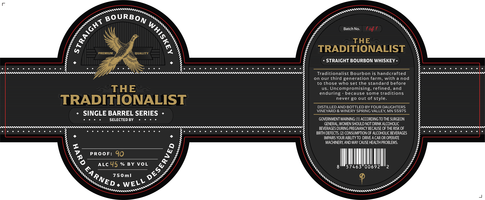

# TTB COLA Label Images - TTBID 26143001000097

**Brand Name:** THE TRADITIONALIST

**Issue Date:** 06/03/2026

**Origin Code:** 27

**Product Class/Type:** 101

**Source:** [TTB Public COLA Registry](https://ttbonline.gov/colasonline/viewColaDetails.do?action=publicFormDisplay&ttbid=26143001000097)

## Label Images

### Label 1

## Extracted Label Text

*Text extracted via OCR - may contain errors*

**Detected Proof:** 90

### Label 1

BOURBON
Batch No.
1 0} 1
THE
PREMIUM
QUALITY
TRADITIONALIST
STRAIGHT BOURBON WHISKEY
Traditionalist Bourbon is handcrafted
on our third generation farm, with a nod
to those
who set the standard before
THE
us_
Uncompromi
refined, and
endur
because some traditions
TRADITIONALIST
never go out of style_
DISTILLED AND BOTTLED BY FOUR DAUGHTERS
VINEYARD & WINERY SPRING VALLEY, MN 55975
SINGLE BARREL SERIES
SELECTED BY
GOVERNMENTWARNING: (1) ACCORDING TO THE SURGEON
GENERAL, WOMEN SHOULD NOT DRINK ALCOHOLIC
BEVERAGES DURING PREGNANCY BECAUSE OF THE RISK OF
BIRTH DEFECTS: (2) CONSUMPTION OF ALCOHOLIC BEVERAGES
IMPAIRS YOUR ABILITY TO DRIVE A CAR OR OPERATE
MACHINERY AND MAY CAUSE HEALTH PROBLEMS.
PROoF:
90
ALc 45 % BY VOL
8
57463"00692
2
75 0m]
[
1
sing,
ring
1
3
L
EARNED '
WELL
Ittttt
