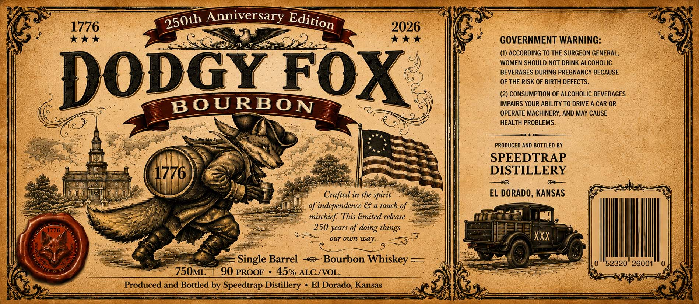
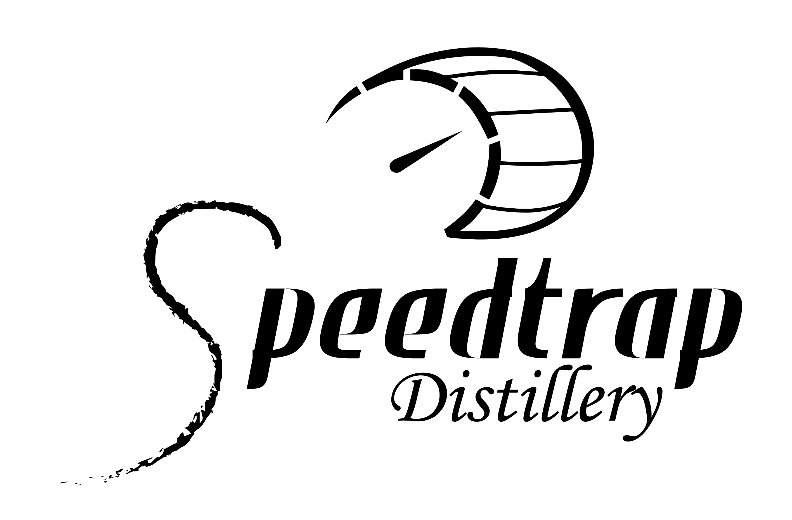

# TTB COLA Label Images - TTBID 26143001000135

**Brand Name:** DODGY FOX

**Fanciful Name:** SINGLE BARREL BOURBON

**Issue Date:** 06/01/2026

**Origin Code:** 21

**Product Class/Type:** 141

**Source:** [TTB Public COLA Registry](https://ttbonline.gov/colasonline/viewColaDetails.do?action=publicFormDisplay&ttbid=26143001000135)

## Label Images

### Label 1

### Label 2

## Extracted Label Text

*Text extracted via OCR - may contain errors*

*1 image(s) excluded: text did not meet readability threshold*

**Detected Proof:** 90

### Label 1

Anniversary
1776
2026
7
GOVERNMENT WARNING:
(1) ACCORDING TO THE SURGEON GENERAL;
WOMEN SHOULD NOT DRINK ALCOHOLIC
Dopoy FOX
BFVERAG1Ek Dfrirg pDegNcTGY
BECAUSE
(2) CONSUMPTION OF ALCOHOLIC BEVERAGES
BOURBO N
IMPAIRS YOUR ABILITY TO DRIVE A CAR OR
OPERATE MACHINERY, AND MAY CAUSE
HEALTH PROBLEMS
PRODUCED AND BOTTLED BY
SPEEDTRAP
1776
DISTILLERY
Crafted in the spirit
EL DORADO, KANSAS
of independence & a touch of
mischief: This limited release
1776
250 years of
our own way:
XXX
Single Barrel
Bourbon
Whiskey
"52320" 26001
750ML
90 PROOF
45% ALCIVOL.
Produced and Bottled by Speedtrap Distillery
El Dorado, Kansas
Edition
250th
doing
things
