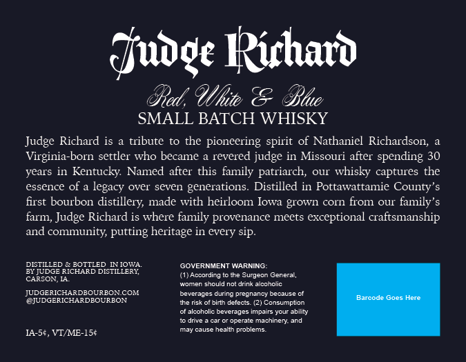
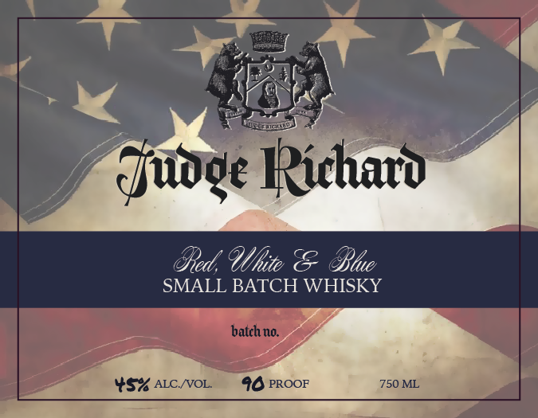

# TTB COLA Label Images - TTBID 26144001000017

**Brand Name:** JUDGE RICHARD

**Fanciful Name:** RED, WHITE & BLUE SMALL BATCH WHISKY

**Issue Date:** 05/29/2026

**Origin Code:** 20

**Product Class/Type:** 140

**Source:** [TTB Public COLA Registry](https://ttbonline.gov/colasonline/viewColaDetails.do?action=publicFormDisplay&ttbid=26144001000017)

## Label Images

### Back Label

### Front Label

## Extracted Label Text

*Text extracted via OCR - may contain errors*

**Detected Proof:** 98
**Detected Age:** 30 Years

### Back Label

duvge Ruhato
Ued, 9lhite & Ble
SMALL BATCH WHISKY
Judge Richard is
tribute
to the
pioneering spirit of Nathaniel Richardson;
Virginia-born settler who became
revered judge in Missouri after spending 30
years in Kentucky Named after this family patriarch;
OUl
whisky captures the
essence of a legacy over seven generations. Distilled in Pottawattamie County' $
first bourbon
distillery, made with heirloom Iowa grown cOrn from our family'
farm; Judge Richard is where family provenance meets exceptional craftsmanship
and comunity; putting heritage in every sip.
DISTILLED
BOTTLED WIOWA
GOVERNMENT WARNING:
BY JUDGE RICHARD DISTILLERY
(1) According
Surgeon General,
CARSON,1A
omen
snould notdrnk
Icongic
JUDGERICHARDBOURBONCOM
Deveraces Qunng orecnang detause
@JUDGERICHARDBOCRBON
thensk
birth defecs (21
Consumpton
Barcode Goes Here
alcoholic Deverdes Imojin
our abiity
Car 0 Odeiate
machinery and
May Gjuse
eald
problems
IA-5e,VT ME-15c

### Front Label

qjuoge Ikichatv
Oed; 9lhite & Ble
SMALL BATCH WHISKY
batch to.
YS% ALC NOL
98 PROOF
750 ML
