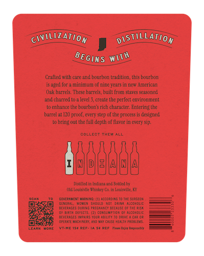
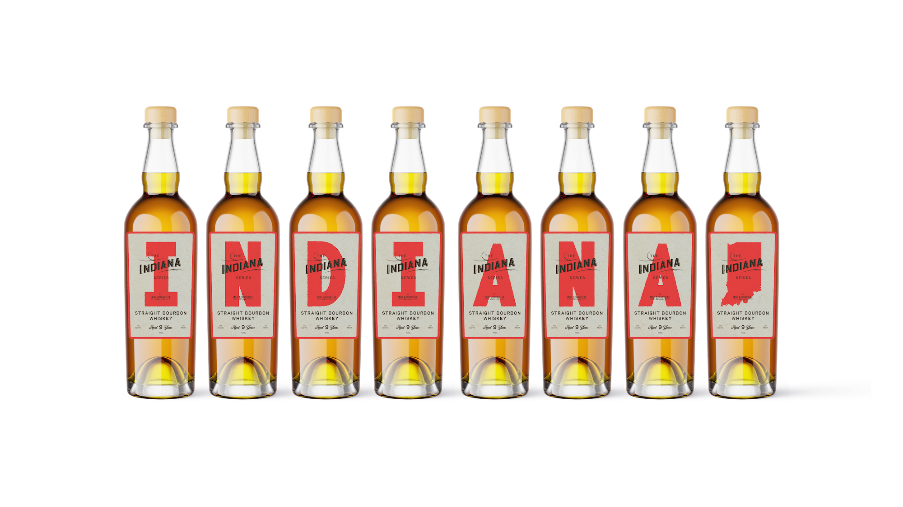

# TTB COLA Label Images - TTBID 26144001000081

**Brand Name:** INDIANA SERIES BY OLD LOUISVILLE WHISKEY CO.

**Issue Date:** 05/28/2026

**Origin Code:** 22

**Product Class/Type:** 101

**Source:** [TTB Public COLA Registry](https://ttbonline.gov/colasonline/viewColaDetails.do?action=publicFormDisplay&ttbid=26144001000081)

## Label Images

### Back Label

### Front Label

## Extracted Label Text

*Text extracted via OCR - may contain errors*

### Back Label

CIvILOZATION
DOSTILLATION
Crafted with care and bourbon Lradition, this bourbon
is aged for & minimum of nine years in new American
Qak barrels: These barrels; built troni staves se asoned
and charred to 3 level 3, create the perfect environrent
to enhance the bourbon $ rich character. Entering the
barrel -
evety
step of the process is designed
to bring out the full depth of flavor in every sip.
COLLECT
THEU ALL
JBBEBB
RAeladhaan Rottlch
Old Loubk This*L
in buicilk E
Gomerlvent ^iding: (I1icCO  4G [0 Ihe surgeO
ceve
MEt
ehen
Cat MCo-omc
BEUeRiSES Oubing Peeg igucuse Ciicas
Kbih Gc
cuntUAO {
ACc-Mc
aTea pa
We
hee!c
W
ViLtXEdAAAuatus
LEARN
YTA
Aaeneeek
BEGINS
WOth
prcof, [
Lucic

### Front Label

ERIE'
Sekize
ERIz
SEKIES
Sekizs
StrAight bourbon
StRAiGHT BOURBON
STRAIGHT Boureon
STRAiGHT BOURBON
STRAIGHT Boureon
STRAIGHT BouRecn
StrAight bourbon
STRAiGHT BOURBON
whisKEY
WhISkEY
whISKEY
#FISKEY
whISKEY
whISKEY
whiskEY
#FISKEY
3
Iat
9 %"
9 4s
064 9 %kts
0644 9 %ft
064
It
INDIANA
[NDIANA
[NDIANA
NDIANA
[NDIANA
[NDIANA
INDIANA
INDIANA
