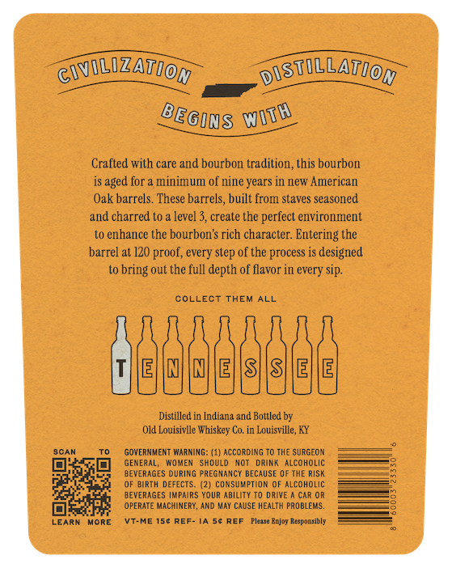
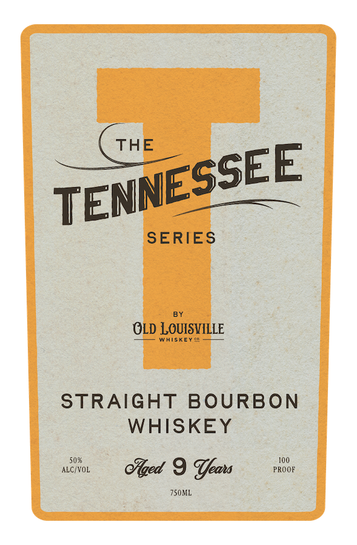

# TTB COLA Label Images - TTBID 26144001000083

**Brand Name:** TENNESSEE SERIES BY OLD LOUISVILLE WHISKEY CO.

**Issue Date:** 05/28/2026

**Origin Code:** 22

**Product Class/Type:** 101

**Source:** [TTB Public COLA Registry](https://ttbonline.gov/colasonline/viewColaDetails.do?action=publicFormDisplay&ttbid=26144001000083)

## Label Images

### Back Label

### Front Label

## Extracted Label Text

*Text extracted via OCR - may contain errors*

**Detected Proof:** 120

### Back Label

CvILIZATION
DISTULLATIOM
Crafted with care and bourbon tradition,this bourbon
aged for =
minimum of nine years in new American
Oak barrels. These barrels, built from staves seasoned
aIld charred t0
level 3, create the perfect environment
to enhance the bourbon $ rich character:
Entering the
barrel at 120 proof; every step of the process is designed
bring out the full depth of flavor in every sip
COLLECT
THEM ALL
E
S
SHE
E
Distilled in Indiana and Boltled by
Old Louisivlle Whiskey Co. in Louisville, KY
SCAN
GOveRMMENT Warming: (1) according
The SurGEON
GENERAL;
Wmnax
SHOULD
NOT
DRINR
alcoholic
BEVERAGES during PreGNaNCY BECAUSE OF THE RISK
OF BIRTH DEFECTS:
(2) consuwptidm OF alcoholic
BEVERAGES IMPAIRS YOUR Ability T0 dRive
CaR OR
OPERATE MachinerY, AND May CAUSE HEALTH PROBLEMS.
LEARN
MoRE
VT-ME 150 REF- I4
REF
Plexse Bejoy Responsibly
WITh
BEGIQS

### Front Label

THE
SERIES
OLD LOUISVILLE
WhiskEY s
STRAIGHT
BOURBON
WHISKEY
50%
10O
ALC VOL
cZed 9 Team
PROOF
Z5OML
TENNESSEE
