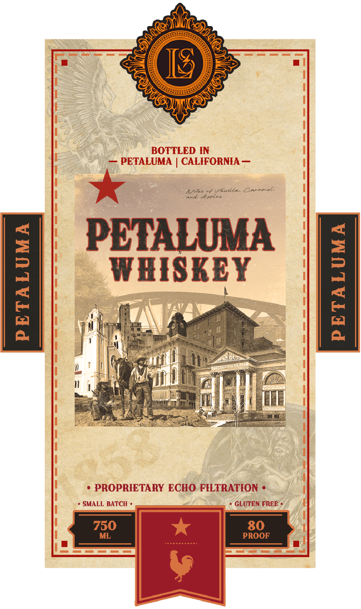
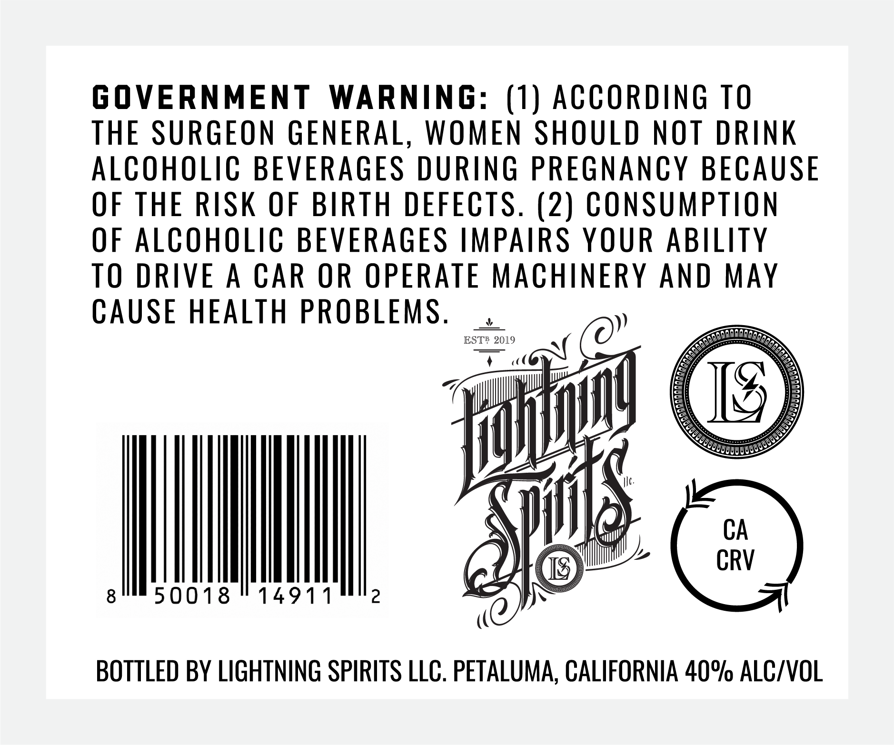

# TTB COLA Label Images - TTBID 26144001000084

**Brand Name:** PETALUMA WHISKEY

**Issue Date:** 06/01/2026

**Origin Code:** 01

**Product Class/Type:** 140

**Source:** [TTB Public COLA Registry](https://ttbonline.gov/colasonline/viewColaDetails.do?action=publicFormDisplay&ttbid=26144001000084)

## Label Images

### Label 1

### Label 2

## Extracted Label Text

*Text extracted via OCR - may contain errors*

**Detected Proof:** 80

### Label 1

U
BOTTLED IN
PETALUMA
CALIFORNIA
Nsfs
Uulla,
CanameL,
Arple
PETALUMA

WBISKEY
1
PROPRIETARY ECHO FFETRATION
SMALL BATCH
GLUTEN FREE
750
80
ML
PROOF
AL

### Label 2

GOVERNMENT
WARNING: (1) ACCORDING TO
THE SURGEON GENERAL, WOMEN SHOULD NOT DRINK
AlcOhOLiC BEVERAGES DURING PREGNANCY BECAUSE
OF THE RISK OF BIRTH DEFECTS. (2) CONSUMPTION
OF ALCOHOLIC BEVERAGES IMPAIRS YOUR ABILITY
TO DRIVE
CAR OR OPERATE MACHInERY AND MAy
CAUSE HEALTH PROBLEMS ,
ESTB 2019
CA
TS
CRV
8
50018
14911
2
BOTTLed BY LIGHTNING SPIRITS LLC. PETALUMA, CALIFORNIA 40% ALC/VOL
