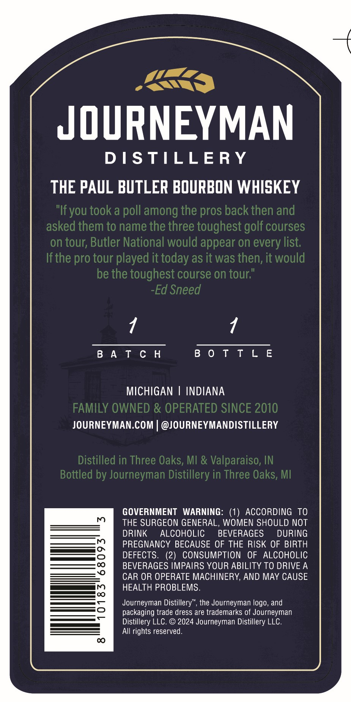
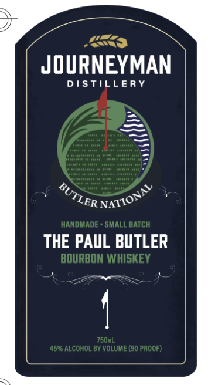

# TTB COLA Label Images - TTBID 26145001000052

**Brand Name:** JOURNEYMAN DISTILLERY

**Fanciful Name:** THE PAUL BUTLER BOURBON WHISKEY

**Issue Date:** 05/29/2026

**Origin Code:** 06

**Product Class/Type:** 141

**Source:** [TTB Public COLA Registry](https://ttbonline.gov/colasonline/viewColaDetails.do?action=publicFormDisplay&ttbid=26145001000052)

## Label Images

### Back Label

### Front Label

## Extracted Label Text

*Text extracted via OCR - may contain errors*

### Back Label

JOURNEYMAN
D I STILLERY
THE PAUL BUTLER BOURBON WHISKEY
"Ifyou took a poll among the pros back then and
asked them to name the three toughest golf courses
on tour; Butler National would appear on every list;
Ifthe pro tour played it today as it was then; it would
be the toughest course on tour;"
Ed Sneed
B 4 T € H
B 0 T T L E
MICHIGAN
INDIANA
FAMILY OWNED & OPERATED SINCE 2010
JOURNEYMAN.COM | @JOURNEYMANDISTILLERY
Distilled in Three Oaks, MI & Valparaiso; IN
Bottled by Journeyman Distillery in Three Oaks, MI
GOVERNMENT   WARNING:
ACCORDING TO
THE SURGEON GENERAL, WOMEN SHOULD NOT
DRINK
ALCOHOLIC
BEVERAGES
DURING
PREGNANCY BECAUSE OF THE RISK OF BIRTH
DEFECTS.
(2)
CONSUMPTION
OF ALCOHOLIC
BEVERAGES IMPAIRS YOUR ABILITY TO DRIVE A
CAR OR OPERATE MACHINERY, AND MAY CAUSE
0
HEALTH PROBLEMS.
Journeyman Distillery", the Journeyman logo, and
packaging trade dress are trademarks of Journeyman
Distillery LLC.
@ 2024 Journeyman Distillery LLC.
All rights reserved.
C

### Front Label

JOURNEYMAN
DSTILLERY
HANDMADE
SMALL BaTcH
THE PAUL BUTLER
BOURBON WHISKEY
7504L
4596 ALcoHOL BY VOLUME (90 PAOOF)
BUTLER `
NATIONAL
