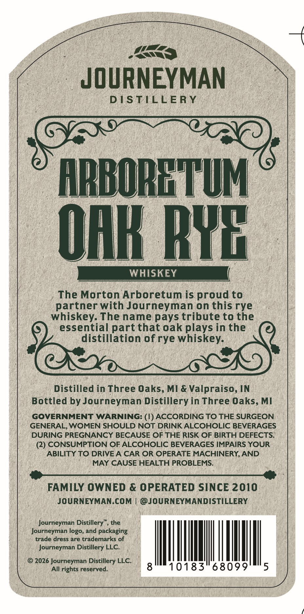
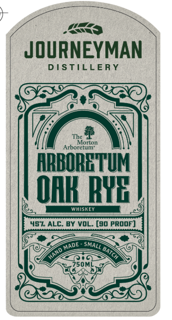

# TTB COLA Label Images - TTBID 26145001000067

**Brand Name:** JOURNEYMAN DISTILLERY

**Fanciful Name:** ARBORETUM OAK RYE WHISKEY

**Issue Date:** 05/29/2026

**Origin Code:** 06

**Product Class/Type:** 140

**Source:** [TTB Public COLA Registry](https://ttbonline.gov/colasonline/viewColaDetails.do?action=publicFormDisplay&ttbid=26145001000067)

## Label Images

### Back Label

### Front Label

## Extracted Label Text

*Text extracted via OCR - may contain errors*

**Detected Proof:** 90

### Back Label

<<

: JOURNEYMAN

DISTILLERY

‘ARBORETUM
OAK RYE

) WHISKEY

_ The Morton Arboretum is proud to
partner with Journeyman on this rye
whiskey. The name pays tribute to the
essential part that oak plays in the
distillation of rye whiskey.

Distilled in Three Oaks, MI & Valpraiso, IN
Bottled by Journeyman Distillery in Three Oaks, MI
GOVERNMENT WARNING: (1) ACCORDING TO THE SURGEON
GENERAL, WOMEN SHOULD NOT DRINK ALCOHOLIC BEVERAGES
DURING PREGNANCY BECAUSE OF THE RISK OF BIRTH DEFECTS,

(2) CONSUMPTION OF ALCOHOLIC BEVERAGES IMPAIRS YOUR
ABILITY TO DRIVE A CAR OR OPERATE MACHINERY, AND
MAY CAUSE HEALTH PROBLEMS.

Ac ch AMERDUTSACAT RTAMEIS DEIN JEN SARTRE MCL LE AEE AT oea
FAMILY OWNED & OPERATED SINCE 2010
JOURNEYMAN.COM | @JOURNEYMANDISTILLERY

Journeyman Distillery”, the
Journeyman logo, and packaging
trade dress are trademarks of

Journeyman Distillery LLC.

© 2026 Journeyman cise LLC.
All rights reserved

### Front Label

JOURNEYMAN
DISTILLERY
The
Morton
Arboretum"
ARBORETUM
OHKByF
WHISKEY
457 ALC: BY VOL_ [90 prOOF]
Made
SMALL
batcH
