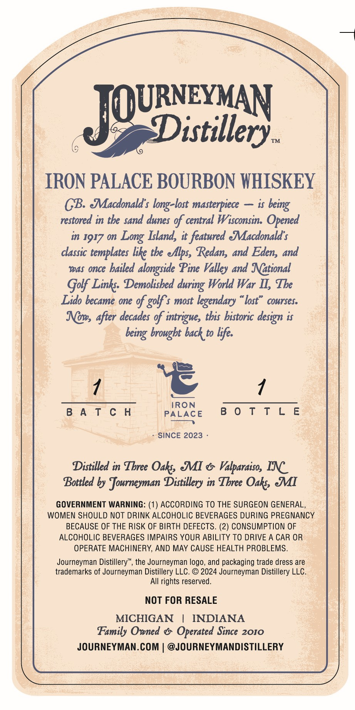
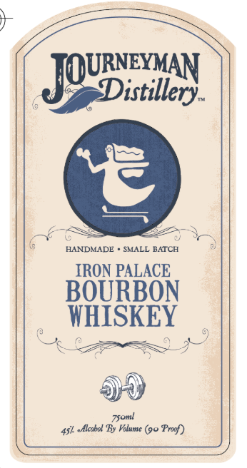

# TTB COLA Label Images - TTBID 26145001000111

**Brand Name:** JOURNEYMAN DISTILLERY

**Fanciful Name:** IRON PALACE BOURBON WHISKEY

**Issue Date:** 05/29/2026

**Origin Code:** 06

**Product Class/Type:** 141

**Source:** [TTB Public COLA Registry](https://ttbonline.gov/colasonline/viewColaDetails.do?action=publicFormDisplay&ttbid=26145001000111)

## Label Images

### Back Label

### Front Label

## Extracted Label Text

*Text extracted via OCR - may contain errors*

**Detected Proof:** 90

### Back Label

TOURNEYVAN
Distillery_
TM
IRON PALACE BOURBON WHISKEY
CB Macdonald s long-lost masterpiece
is
restored in tbe sand dunes %f central Wisconsin. Opened
in 1917 0n
Island, it featured Jacdonald' $
classic
like tbe ellps, Redan, and Eden, and
was once bailed alngside Pine Valley and National
Golf Link: Demolisbed
World War II; Tbe
Lido became one %f golf $ most legendary
lost"
cowrses:
Nows after decades %f intrigue, this bistoric design i$
brougbt back to life.
IRON
B A T C H
PALACE
8 0 T T L E
SINCE 2023
Distilled in Tbree
Oaks MI
Valparaiso, IN
Bottled by Journeyman Distillery in Tbree Oaks JI
GOVERNMENT WARNING: (1) ACCORDING TO THE SURGEON GENERAL,
WOMEN SHOULD NOT DRINK ALCOHOLIC BEVERAGES DURING PREGNANCY
BECAUSE OF THE RISK OF BIRTH DEFECTS. (2) CONSUMPTION OF
ALCOHOLIC BEVERAGES IMPAIRS YOUR ABILITY TO DRIVE A CAR OR
OPERATE MACHINERY, AND MAY CAUSE HEALTH PROBLEMS.
Journeyman Distillery" , the Journeyman logo, and packaging trade dress are
trademarks of Journeyman Distillery LLC_
@ 2024 Journeyman Distillery LLC.
AIl rights reserved.
NOT FOR RESALE
MICHIGAN
INDIANA
Family Owned
Operated Since 2010
JOURNEYMAN.COM
@JOURNEYMANDISTILLERY
being
Long
templates
during
being

### Front Label

JQUBixiler
HANDMADE
SMALL BATCH
IRON PALACE
BOURBON
WHISKEY
45k ~Alcobol By Volume (90 Proof)
T5oml
