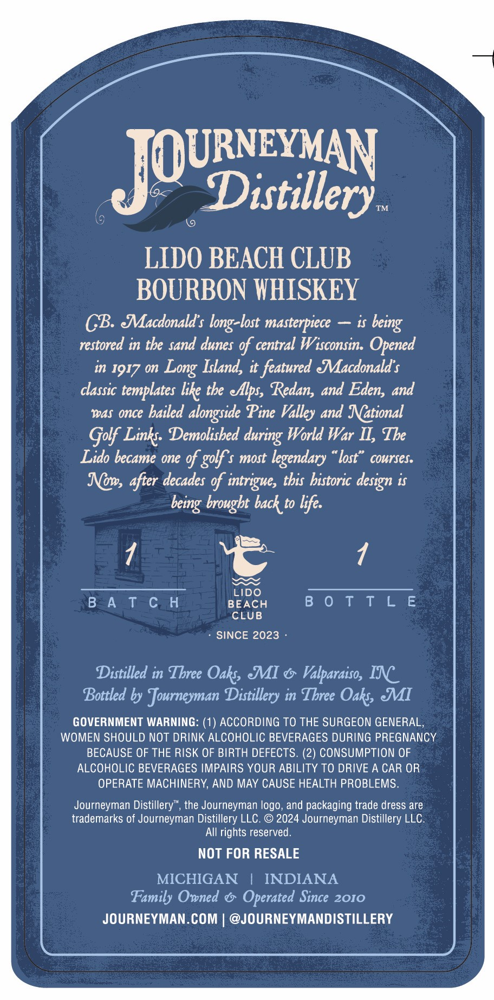
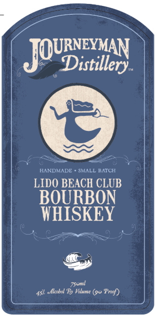

# TTB COLA Label Images - TTBID 26145001000116

**Brand Name:** JOURNEYMAN DISTILLERY

**Fanciful Name:** LIDO BEACH CLUB BOURBON WHISKEY

**Issue Date:** 05/29/2026

**Origin Code:** 06

**Product Class/Type:** 101

**Source:** [TTB Public COLA Registry](https://ttbonline.gov/colasonline/viewColaDetails.do?action=publicFormDisplay&ttbid=26145001000116)

## Label Images

### Back Label

### Front Label

## Extracted Label Text

*Text extracted via OCR - may contain errors*

### Back Label

JQUDirey
TM
LIDO BEACH CLUB
BOURBON WHISKEY
CB Macdonald $ long-lost masterpiece
is
in tbe sand dunes of central Wisconsin. Opened
in 19I7 o
Island, it featured &acdonald $
classic
templates like tbe ellps, Redans and Edens and
was Once
bailed alongside Pine
and National
Golf Links: Demolisbed
World War II, Tbe
Lido became one of golf $ most legendary
lost"
cowrses:
Now, after decades of intrigue, tbis bistoric design is
brougbt back to life:
LIDO
B A T € H
BEACH
B 0 T t L E
CLUB
SINCE 2023
Distilled in Tbree Oaks &I
Valparaiso, INC
Bottled by Journeyman Distillery in Tbree Oaks MI
GOVERNMENT WARNING: (1) ACCORDING TO THE SURGEON GENERAL,
WOMEN SHOULD NOT DRINK ALCOHOLIC BEVERAGES DURING PREGNANCY
BECAUSE OF THE RISK OF BIRTH DEFECTS: (2) CONSUMPTION OF
ALCOHOLIC BEVERAGES IMPAIRS YOUR ABILITY TO DRIVE A CAR OR
OPERATE MACHINERY, AND MAY CAUSE HEALTH PROBLEMS
Journeyman Distillery", the Journeyman logo, and packaging trade dress are
trademarks of Journeyman Distillery LLC
2024 Journeyman Distillery LLC
AIl rights reserved.
NOT FOR RESALE
MICHIGAN
INDIANA
Family Owned
Operated Since 2010
JOURNEYMAN.COM
@JOURNEYMANDISTILLERY
being
restored
Long
Valley
during
being

### Front Label

JOURixxiley
HANDMADE
SMALL BATCH
LIDO BEACH CLUB
BOURBON
WHISKEY
elcohol 'By Volume (9u Presf)
Ssoml
