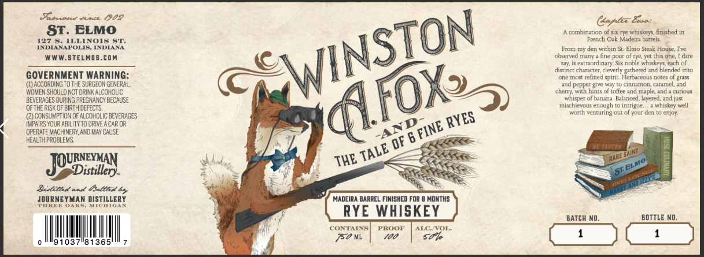

# TTB COLA Label Images - TTBID 26145001000124

**Brand Name:** JOURNEYMAN DISTILLERY

**Fanciful Name:** WINSTON A. FOX AND THE TALE OF 6 FINE RYES

**Issue Date:** 05/29/2026

**Origin Code:** 06

**Product Class/Type:** 142

**Source:** [TTB Public COLA Registry](https://ttbonline.gov/colasonline/viewColaDetails.do?action=publicFormDisplay&ttbid=26145001000124)

## Label Images

### Label 1

## Extracted Label Text

*Text extracted via OCR - may contain errors*

### Label 1

Llice
70?
Gatb- Eua:
ST. ELMO
A combination of six TyC whiskeys, finished in
127 5_
ILLINOIS ST_
French O1k Maceira bunels
INDANAPOLIS; INDIANA
From my den within St Elmo Steik House; Ive
WWW.STELADS.COM
cuserved many .
puu
of rye; Yet this one;
Extaordilav
Six noble whiskeys each of
distnct character; cleverly gathered and blended into
GOVERNMENT WARNING:
onc most Tchned spint Hernaccous notes
BTass
(1) ACCORDINGTOTHE SURGEOM GENERAL,
pepper give Way
Fnnamon CAMELand
WOMEN ShOULd NOT @RINK ALCOHOLIC
cherry; with hints of toffee and maple
cunous
BEVERAGES DURING PREG NANCY BECAUSE
Olbaman?
Haneru
layered, and just
OFTHE RISK OF BIRTH defects;
Mschieroue
enough
lnuleue
whiskey well
warth venturing cut of your den
enpy
CCNSUVPTIOV OF AlcoHOLIC beveraGeS
IMPAIRS VOUR ABILITYTO dRIVE A CAR OR
OPERATE MACHINERY, AND MAy CAUSE
HEALTH PROBLERS
OF 6
TaVerN
THE
Distillery
St:
Adttbed an4 /faltt4y
JODRNEYMAN DISTILLERY
MADEIRA BARREL FINISHED FOR
MONTHS
REE
OAKS
MICMTCAR
RYE WHISKEY
BATCH NO_
BOTTLE ND
CONTANNS
PROOF
ALC NVOL:
150 ML
700
5ot
91037"81365
WINSTON
hc
duc
QFOXS
wnispel
RYES
AND
FINE
TALE
RARE SAINI
JOURVEYMAN
ELMO
