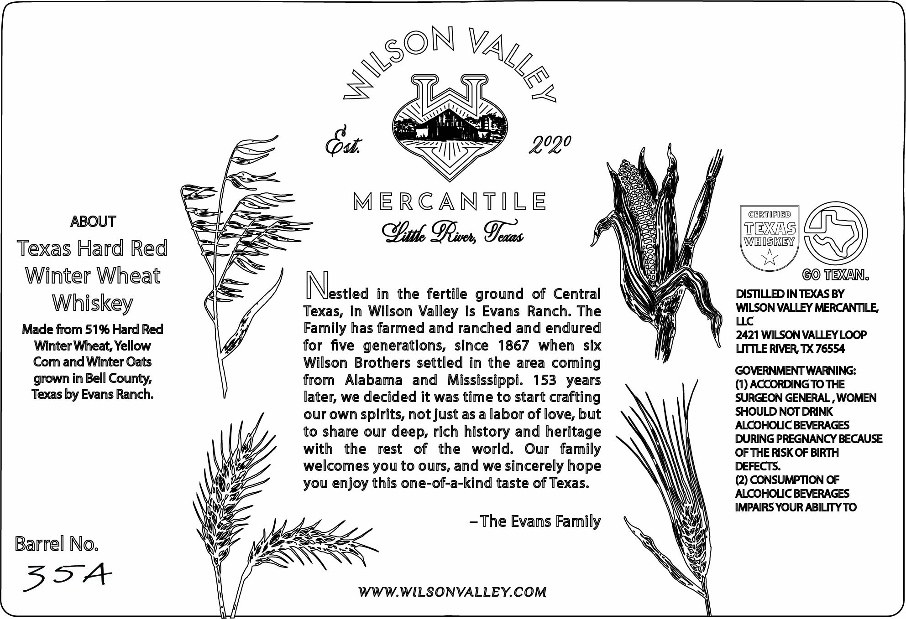
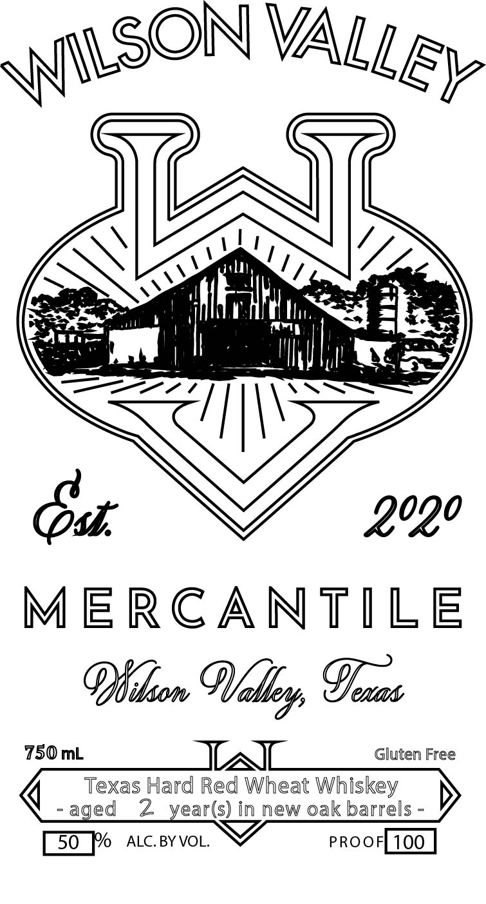

# TTB COLA Label Images - TTBID 26145001000286

**Brand Name:** WILSON VALLEY MERCANTILE

**Fanciful Name:** TEXAS HARD RED WINTER WHEAT WHISKEY

**Issue Date:** 05/29/2026

**Origin Code:** 44

**Product Class/Type:** 140

**Source:** [TTB Public COLA Registry](https://ttbonline.gov/colasonline/viewColaDetails.do?action=publicFormDisplay&ttbid=26145001000286)

## Label Images

### Back Label

### Label 1

## Extracted Label Text

*Text extracted via OCR - may contain errors*

**Detected Age:** 2 Years

### Back Label

ABOUT
Texas Hard Red
Winter Wheat
Whiskey

Made from 51% Hard Red
Winter Wheat, Yellow
Com and Winter Oats
grown in Bell County,
Texas by Evans Ranch.

Barrel No.

335A

Nestled in the fertile ground of Central
Texas, in Wilson Valley is Evans Ranch. The
Family has farmed and ranched and endured
for five generations, since 1867 when six
Wilson Brothers settled in the area coming
from Alabama and Mississippi. 153 years
later, we decided it was time to start crafting
our own spirits, not just as a labor of love, but
to share our deep, rich history and heritage
with the rest of the world. Our family
welcomes you to ours, and we sincerely hope
you enjoy this one-of-a-kind taste of Texas.

-The Evans Family

WWW.WILSONVALLEY.COM

CERTIFIED

EXAS
| WEISIXEY |

TEXAN.
DISTILLED IN TEXAS BY
WILSON VALLEY MERCANTILE,
LLC
2421 WILSON VALLEY LOOP
LITTLE RIVER, TX 76554

GOVERNMENT WARNING:

(1) ACCORDING TO THE
SURGEON GENERAL , WOMEN
SHOULD NOT DRINK
ALCOHOLIC BEVERAGES
DURING PREGNANCY BECAUSE
OF THE RISK OF BIRTH
DEFECTS.

(2) CONSUMPTION OF
ALCOHOLIC BEVERAGES
IMPAIRS YOUR ABILITY TO

### Label 1

MERCANTILE
Phideon Wedley, Grats

750 mL Gluten Free

(Ss
q Texas Hard Red Wheat Whiskey \
-aged 2 year(s) in new oak barrels -

[50 fo ALC. BY VOL.
