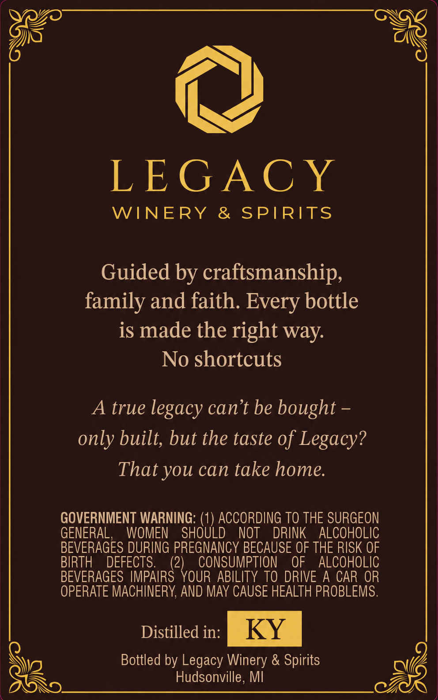
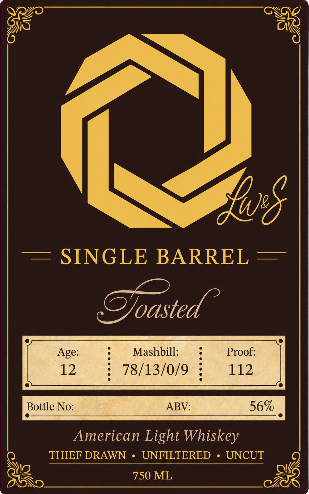

# TTB COLA Label Images - TTBID 26145001000320

**Brand Name:** LW&S

**Issue Date:** 05/29/2026

**Origin Code:** 06

**Product Class/Type:** 144

**Source:** [TTB Public COLA Registry](https://ttbonline.gov/colasonline/viewColaDetails.do?action=publicFormDisplay&ttbid=26145001000320)

## Label Images

### Back Label

### Label 1

## Extracted Label Text

*Text extracted via OCR - may contain errors*

### Back Label

LEGAC Y
WINERY
& SPIRITS
Guided by craftsmanship,
family and faith. Every bottle
is made the right way:
No shortcuts
A true
legacy can t be bought
only built; but the taste of Legacy?
That you can take home
GOVERNMENT WARNING:
ACCORDING TO THE SURGEON
GENERAL,
WOMEN
SHOULD
NOT
DRINK
ALCOHOLIC
BEVERAGES DURING PREGNANCY BECAUSE OF THE RISK OF
BIRTH
DEFECTS.
(2)
CONSUMPTION
OF
ALCOHOLIC
BEVERAGES IMPAIRS YOUR ABILITY TO DRIVE A CAR OR
OPERATE MACHINERY; AND MaY CAUSE HEALTH PROBLEMS.
Distilled in:
KY
Bottled by Legacy Winery & Spirits
Hudsonville, MI

### Label 1

GS 00 ere oe
| ~ |
——= SINGLE BARREL —

Doasted
] Age: = Mashbill: —s Proof: ]
12 F TQieorONO: t, 7 118.
American Light Whiskey
Q THIEF DRAWN + UNFILTERED + UNCUT
il Sen tA some eae awd,
