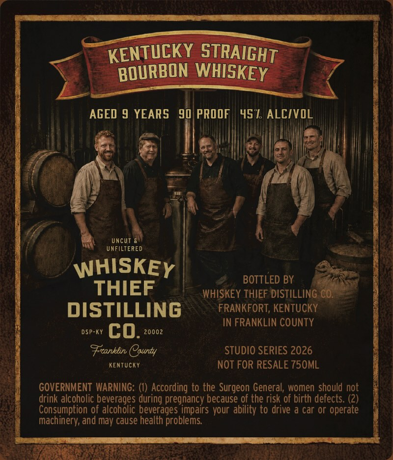
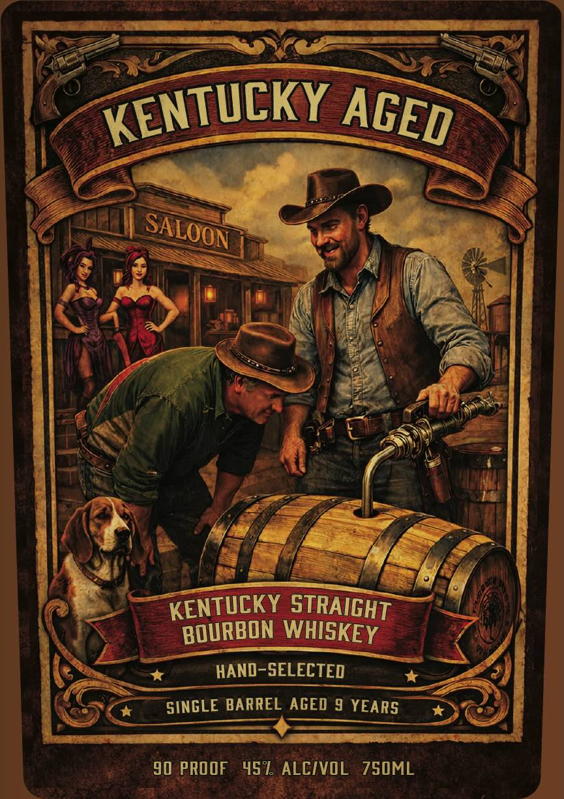

# TTB COLA Label Images - TTBID 26146001000119

**Brand Name:** WHISKEY THIEF DISTILLING CO.

**Fanciful Name:** KENTUCKY AGED

**Issue Date:** 06/24/2026

**Origin Code:** 22

**Product Class/Type:** 101

**Source:** [TTB Public COLA Registry](https://ttbonline.gov/colasonline/viewColaDetails.do?action=publicFormDisplay&ttbid=26146001000119)

## Label Images

### Back Label

### Front Label

## Extracted Label Text

*Text extracted via OCR - may contain errors*

**Detected Proof:** 90
**Detected Age:** 9 Years

### Back Label

KENTUCKY STRAIGHT
BOURBON WHISKEY
AGED 9 YEARS
90 PROOF
451 ALCIVOL
UncUT
UNFILTERED
WHISKEY
BOTTLED BY
THIEF
WHISKEY THIEF DISTILLING CO
DiSTILLING
FRANKFORT, KENTUCKY
IN FRANKLIN COUNTY
DSP-KY
co.
2000z
Fronklin County
STUDIO SERIES 2026
Kentucky
NOT FOR RESALE 750ML
GOVERNMENT WARNING: (I) According to the Surgeon General; women should not
drink alcoholic beverages during pregnancy because of the risk of birth defects. (2)
Consumption of alcoholic beverages impairs your ability to drive & car or operate
machinery; and
cause health problems
may

### Front Label

KENTUCKY STRAIGHT
BOURBON WHISKEY
HAND-SELECTED
SINGLE BARREL AGED 9 YEARS
90 PROOF
452 ALCIVOL
ZS0ML
KENTUCKY
AGED
SALOON
