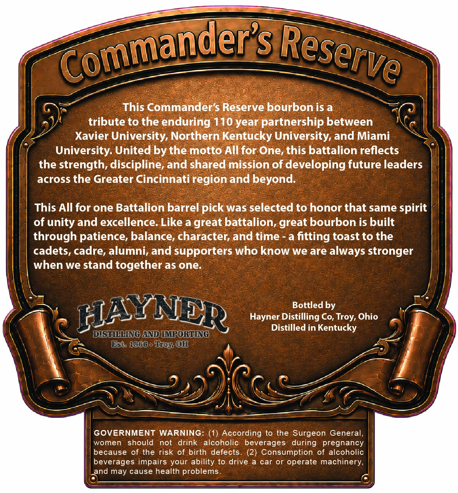
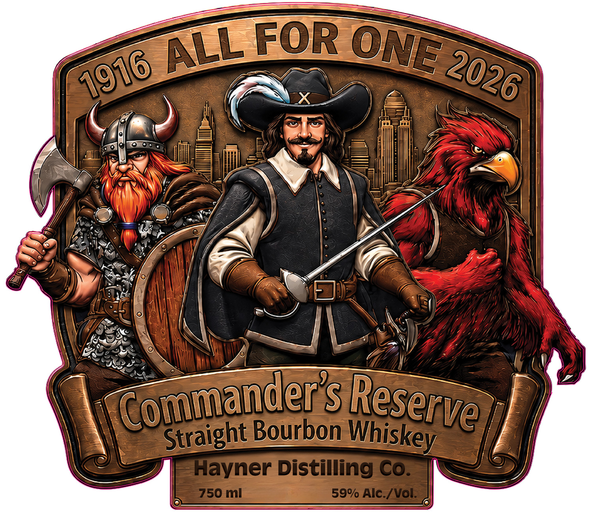

# TTB COLA Label Images - TTBID 26146001000135

**Brand Name:** HAYNER DISTILLING CO.

**Fanciful Name:** COMMANDER'S RESERVE

**Issue Date:** 05/29/2026

**Origin Code:** 09

**Product Class/Type:** 101

**Source:** [TTB Public COLA Registry](https://ttbonline.gov/colasonline/viewColaDetails.do?action=publicFormDisplay&ttbid=26146001000135)

## Label Images

### Back Label

### Front Label

## Extracted Label Text

*Text extracted via OCR - may contain errors*

**Detected Proof:** 118

### Back Label

This Commander's Reserve bourbon is a
tribute to the enduring 110 year partnership between
Xavier University, Northern Kentucky University, and Miami
University: United by the motto All for One, this battalion reflects
the strength, discipline, and shared mission of developing future leaders
across the Greater Cincinnati region and beyond:
This All for one Battalion barrel pick was selected to honor that same spirit
of unity and excellence: Like a great battalion, great bourbon is built
through patience; balance, character and time
a
fitting toast to the
cadets, cadre, alumni,and supporters who know we are always stronger
when we stand together as one:
Bottled by
HAYNER
Hayner Distilling Co,
Ohio
Distilled in Kentucky
DISHLING AND IMRORLING
Esto 1868 - ef @QH
GOVERNMENT
WARNING: (1) According to the Surgeon General,
women
should
not
drink
alcoholic
beverages  during
pregnancy
because of the risk of birth defects. (2) Consumption
of alcoholic
beverages impairs your ability to drive
car or
operate machinery,
and may cause health problems
CommanderS
Reserve
Troy,

### Front Label

FOR
Commanderst
Bourbon
Hayner Distilling Co:
750 ml
59% Alc-/ Vol:
ONE
ALL
2026
1916
Reserve
Whiskey
Straight
