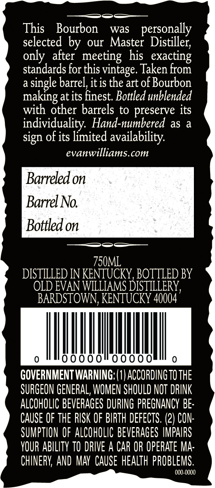
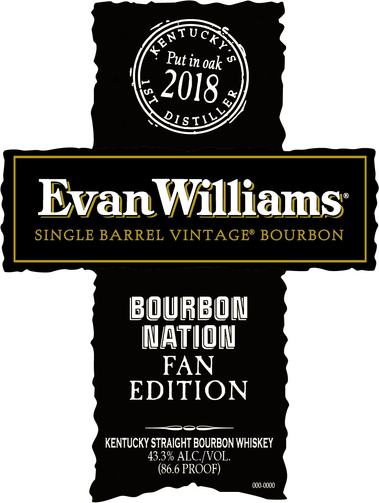

# TTB COLA Label Images - TTBID 26146001000154

**Brand Name:** EVAN WILLIAMS

**Fanciful Name:** SINGLE BARREL

**Issue Date:** 05/29/2026

**Origin Code:** 22

**Product Class/Type:** 101

**Source:** [TTB Public COLA Registry](https://ttbonline.gov/colasonline/viewColaDetails.do?action=publicFormDisplay&ttbid=26146001000154)

## Label Images

### Back Label

### Label 1

## Extracted Label Text

*Text extracted via OCR - may contain errors*

**Detected Proof:** 86.6

### Back Label

SS S

This Bourbon was personally

are by our Master Distiller,

only after meeting his exacting

standards for this vintage. Taken from

a single barrel, it is the art of Bourbon

making at its finest. Bottled unblended

with other barrels to preserve its

individuality. Hand-numbered as a

sign of its limited availability.

evanwilliams.com

Barreled on

Barrel No.

Bottled on

>= S

DISTILLED IN Kehr rNCKY BOTTLED BY

OLD EVAN WILLIAMS DISTILLERY,

BARDSTOWN,

ENTUCKY 40004’

|

00000"00000

GOVERNMENT WARNING: (1) ACCORDING 0 THE

SURGEON GENERAL, WOMEN SHOULD NOT DRINK

ALCOHOLIC BEVERAGES DURING PREGNANCY BE

SUMPTION

CAUSE OF THE RISK OF BIRTH DEFECTS. (2) CON

ALCOHOLIC BEVERAGES IMPAIRS

YOUR ABILITY TO DRIVE A CAR OR OPERATE MA

CHINERY, AND MAY CAUSE HEALTH PROBLEMS.

000-0000

### Label 1

(prucax
EvanWilliams
SINGLE BARREL VINTAGE? BOURBON
BOubOn
Iatlon
FAN
EDITION
KENTuCKY STRAICHT BOURBON WHISKEY
43.3% ALCIVOL.
(86.6 PROOF)
OOO-OOOO
Put in oak
2018
QSILLY
