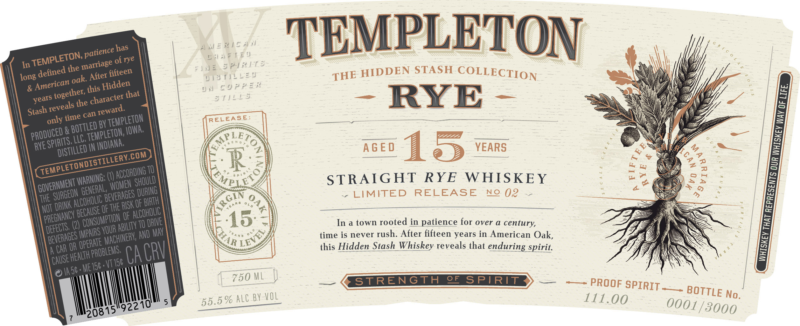

# TTB COLA Label Images - TTBID 26146001000160

**Brand Name:** TEMPLETON

**Issue Date:** 05/29/2026

**Origin Code:** 20

**Product Class/Type:** 102

**Source:** [TTB Public COLA Registry](https://ttbonline.gov/colasonline/viewColaDetails.do?action=publicFormDisplay&ttbid=26146001000160)

## Label Images

### Label 1

### Label 2

## Extracted Label Text

*Text extracted via OCR - may contain errors*

*1 image(s) excluded: text did not meet readability threshold*

**Detected Proof:** 111
**Detected Age:** 15 Years

### Label 1

has
WERTC A N
TEMPLETON
of rye
cwAftsu
In
the
N
3
P-[REHLS-
STASH
long
After fifteen
UTsT)iled
HIDDEN
COLLECTION
&
this
that
V N
50PPER
4
the
s T / !25
RYE
5
only
BY
RELEASE:
3
&
4 2 N &
RVE
IN
Lv
AGE D
15
YEARS
1
R
9
2
(1)
TO
Meig9
STRAIGHT
RYE
W HISKEY
1
LIMITED
RELEASE
Ne 02
7
THE
0
OF
OF
(2)
OF
TO
15
In a town rooted in patience for over @ century,
1
 YOUR =
AND May '
<ukin
time is never rush: After fifteen years in American Oak,
A
OR
CRV
this Hidden Stash Whiskey reveals that enduring spirit
Metsg, VIIS
CA
IA 56 =
750 ML
STRENGTH
0F
SPIRIT
PROOF
SPIRIT _
55.5 % ALC BY VOL
111.00
15
patience ]
TEMPLETON;
marriage '
defined
THE
oak:
American
Hidden
together,
character-
years
reveals
reward.
Stash
can
time
TEMPLETON
Bottled
IOWA:
1
PRODUCED :
TEMPLETON; E
SHETo
LLC,
SPIRITS,
INDIANA;
0
dIStILLED '
TEMPLETONDISTILLERY.CoM
2
2
ACCORDING
]
WARNING: =
2
SHOULD^
GOVERNMENT =
WOMEN
GENERAL,
DURING
SURGEON
BEVERAGES
4RGiN
ALCOHOLIC
BIRTH
7
RISK
DRINK
TEAR &
'0 L 0
THE
NOT
'BECAUSE
ALCOHOLIC =
PREGNANCV [
CONSUMPTION
DRIE
ABILTy ^
DEFECTS:
IMPAIRS
1
BEVERAGES =
MACHINERV;
opeRATe
CAR
PROBLEMS,
HEALTH '
Cause [
BOTTLE
No.
0001/3000
92210'
208"
