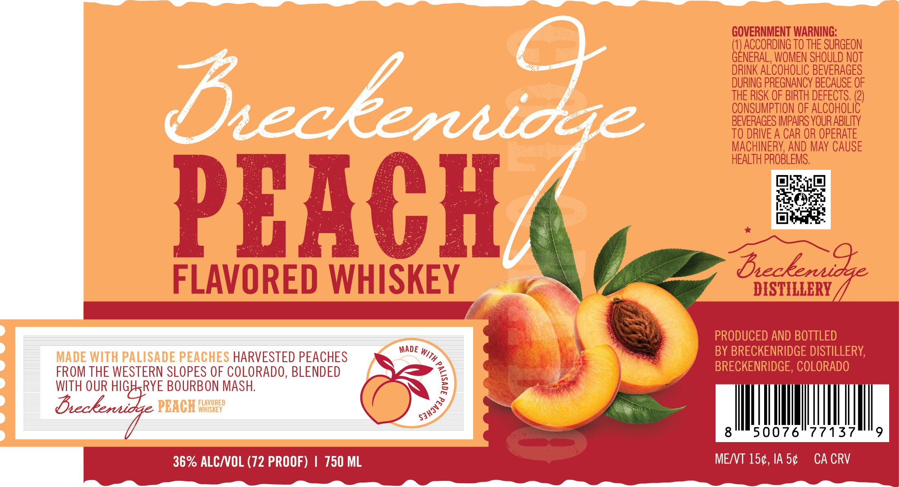

# TTB COLA Label Images - TTBID 26146001000174

**Brand Name:** BRECKENRIDGE

**Fanciful Name:** PEACH FLAVORED WHISKEY

**Issue Date:** 05/29/2026

**Origin Code:** 13

**Product Class/Type:** 149

**Source:** [TTB Public COLA Registry](https://ttbonline.gov/colasonline/viewColaDetails.do?action=publicFormDisplay&ttbid=26146001000174)

## Label Images

### Label 1

## Extracted Label Text

*Text extracted via OCR - may contain errors*

**Detected Proof:** 72

### Label 1

GOVERNMENT WARNING:
(1) ACCORDING To THE SURGEON
GENERAL, WOMEN SHOULD NOT
DRINK ALCOHOLIC BEVERAGES
Dceeuidhe
b4eNs peecbricydecase 26
CONSUMPTION OF ALCOHOLIC
BEVERAGES IMPAIRS YOUR ABILITY
TO DRIVE A CAR OR OPERATE
MACHINERY; AND May CAUSE
HEALTH PROBLEMS,
PEACH
FLAVORED WHISKEY
Dsiszfaenz Ze
PRODUCED AND BOTTLED
MADe
BY BRECKENRIDGE DISTILLERY;
MADE WITh PALISADE PEACHES HARVESTED PEACHES
FROM THE WESTERN SLOPES OF COLORADO, BLENDED
BRECKENRIDGE, COLORADO
WITH OUR HIGHRYE BOURBON MASH:
E
Beckeridge PBACH
F4IORED
8 '
50076
77137
36% ALCNOL (72 PROOF)
750 ML
MENT 150, IA 50
CA CRV
With
6
Sjhav3d
