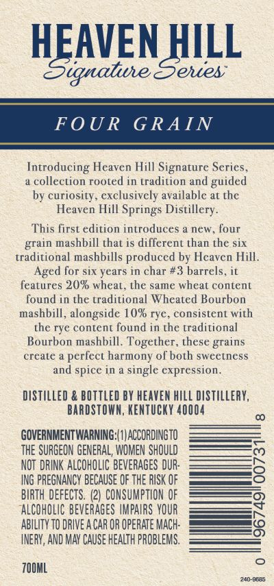
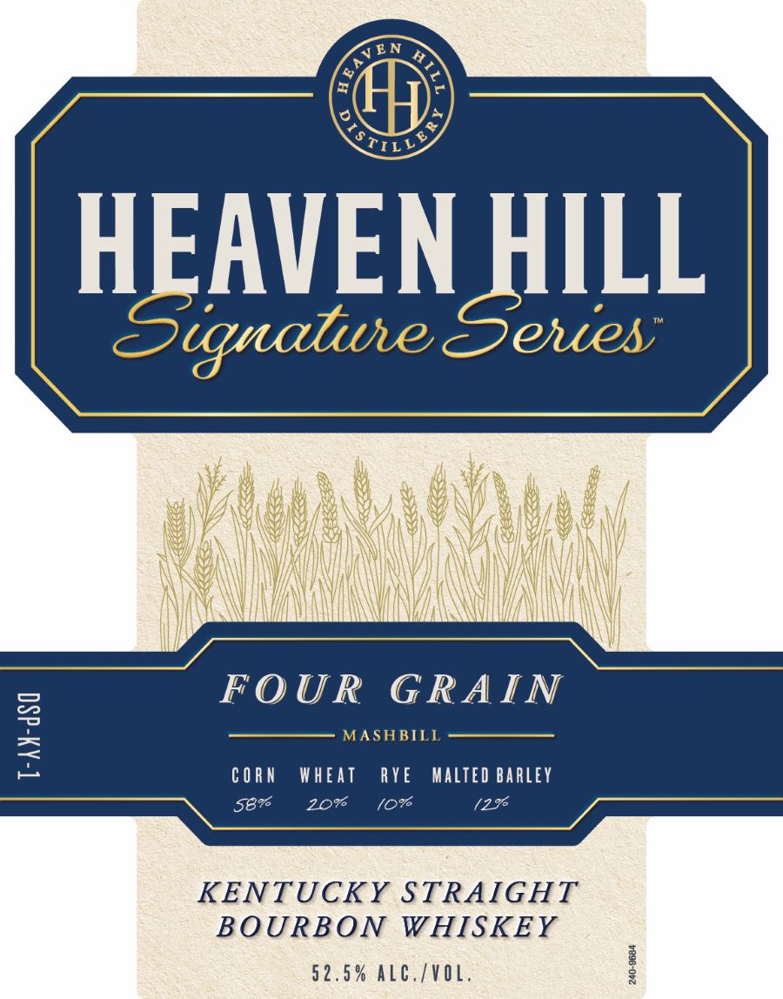

# TTB COLA Label Images - TTBID 26146001000199

**Brand Name:** HEAVEN HILL

**Fanciful Name:** SIGNATURE SERIES

**Issue Date:** 05/29/2026

**Origin Code:** 22

**Product Class/Type:** 101

**Source:** [TTB Public COLA Registry](https://ttbonline.gov/colasonline/viewColaDetails.do?action=publicFormDisplay&ttbid=26146001000199)

## Label Images

### Back Label

### Label 1

## Extracted Label Text

*Text extracted via OCR - may contain errors*

**Detected Proof:** 116

### Back Label

HEAVEN HILL
Signaliue Sehies
FOU R
G RAIN
Introducing Heaven Hill Signature Series
collection rooled in tradition and
by curiosity; exclusively available at the
Heaven Hill Springs Distillery
This first edition introduces a new, four
grain mashbill that is different than the six
traditional mashbills produced by Hcavcn Hill.
Aged for six years in char #3 barrels
features 20% wheat. the Same wheat content
found in the traditional Wheated Bourbon
mashbill , alongside 10% rye ,
consistent with
the rye content found in the traditional
Bourbon mashbill. Together
these
create
perfect harmony of both sweetness
and spice in
single expression
diStILLeD & BOTTLED BY HEAVEN hILL diStILLeRY,
BARDSTOWA, KENTuCKY 40004
GOVERNMENT WARNING; ( #|ACCORDINGTO
thE SURGEON GENERAL, WOMEN SHOULD
NOT  DRINK ALCOHOLIC BeVERAGES DUR:
ING PREGNANCY bECAUSE OF THE RISK OF
BIRTH DEFECTS.
2) CONSUMPTION OF
AALCOhOLIC BEVERAGES IMPAIRS  YOUR
AbILITY TO DRIVE A CAR OR OPERATE MAch:
INERV, AND MAY CAUSe Health PROBLEMS,
ZO0ML
240-9rn5
guided
grains

### Label 1

EN D>

a)

STL

HEAVEN HILL

FOUR GRAIN

MASHBILLI

CORN WHEAT

RYE MALTED BARLEY

58%

Zo

/O%

gat

KENTUCKY STRAIGHT

BOURBON WHISKEY

52.5% ALC./VOL
