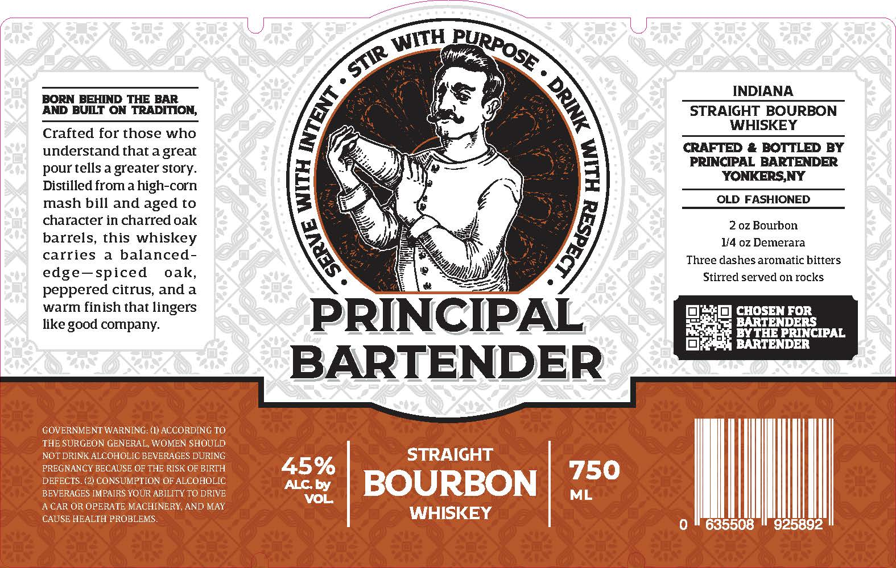

# TTB COLA Label Images - TTBID 26146001000200

**Brand Name:** PRINCIPAL BARTENDER

**Issue Date:** 05/29/2026

**Origin Code:** 02

**Product Class/Type:** 101

**Source:** [TTB Public COLA Registry](https://ttbonline.gov/colasonline/viewColaDetails.do?action=publicFormDisplay&ttbid=26146001000200)

## Label Images

### Label 1

## Extracted Label Text

*Text extracted via OCR - may contain errors*

**Detected Proof:** 90

### Label 1

INDIANA
BORN BEHIND THE BAR
AND BUILT ON TRADITION;
STRAIGHT BOURBON
WHISKEY
Crafted for those who
understand that agreat
CRAFTED
BOTTLED BY
pour tells a
greater story:
1
PRINCIONKBRSNENDER
Distilled
high-corn
1
mash bill and aged to
OLD FASHIONED
character in charred oak
2 oz Bourbon
barrels, this
whiskey
1/4 oz Demerara
carries
balanced-
Three dashes aromatic bitters
edge-spiced
oak_
Stirred served on rocks
peppered citrus, and a
warm finish that lingers
CHOSEN FOR
like good company:
PRINCIPAL
EXTHENRERCIPAL
BARTENDER
BARTENDER
GOVERNMENT WARNING: (1) ACCORDING TO
THE SURGEON GENERAL, WOMEN SHOULD
NOT DRINK ALCOHOLIC BEVERAGES DURING
STRAIGHT
PREGNANCY BECAUSE OF THE RISK OF BIRTH
45%
750
DEFECTS. (2) CONSUMPTION OF ALCOHOLIC
ACby
BOURBON
BEVERAGES IMPAIRS YOUR ABILITY TO DRIVE
VOL
ML
A CAR OR OPERATE MACHINERY, AND MAY
CAUSE HEALTH PROBLEMS .
WHISKEY
0
635508
925892
WITH
PURPOSE
STIR
1
0
from
1
1
