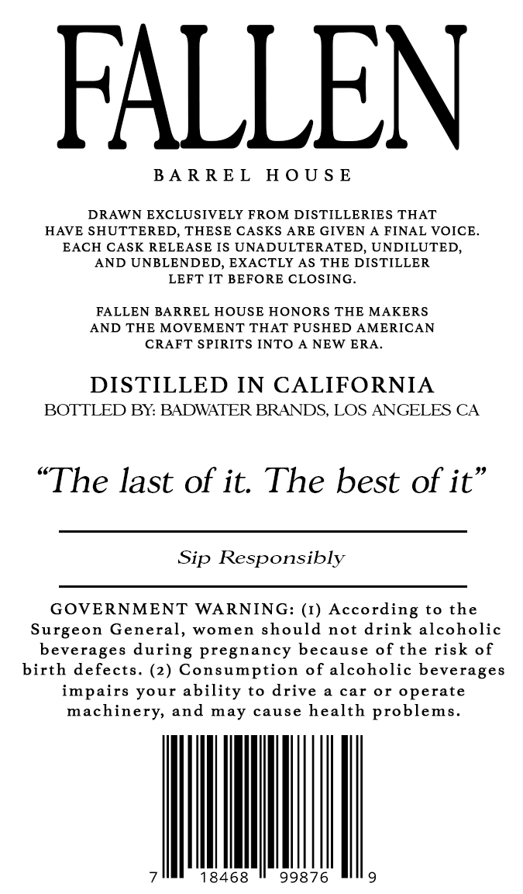
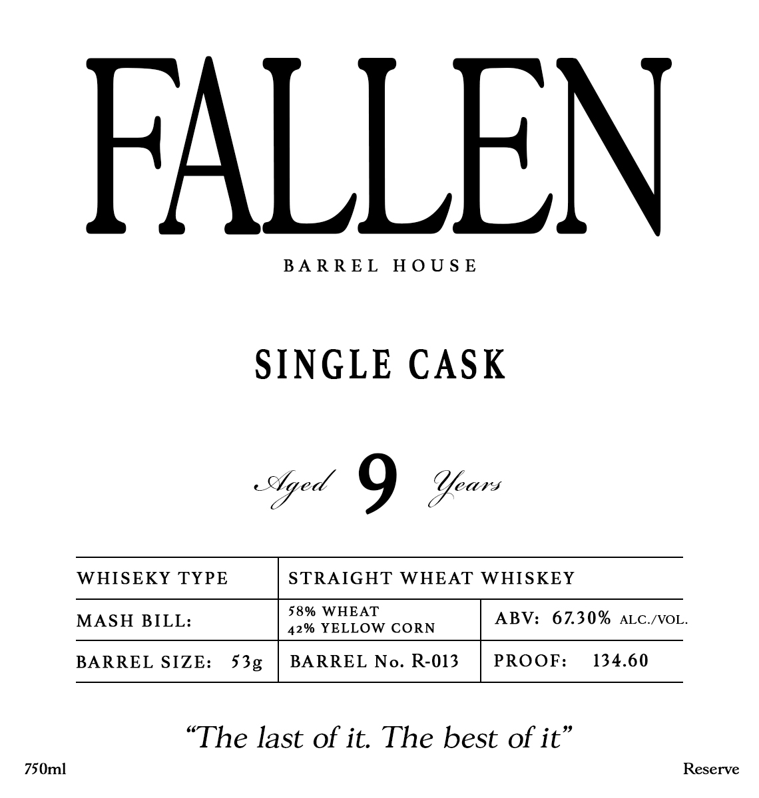

# TTB COLA Label Images - TTBID 26146001000381

**Brand Name:** FALLEN BARREL HOUSE

**Issue Date:** 05/29/2026

**Origin Code:** 01

**Product Class/Type:** 109

**Source:** [TTB Public COLA Registry](https://ttbonline.gov/colasonline/viewColaDetails.do?action=publicFormDisplay&ttbid=26146001000381)

## Label Images

### Back Label

### Label 1

## Extracted Label Text

*Text extracted via OCR - may contain errors*

**Detected Proof:** 134.6

### Back Label

FALLEN

BARREL HOUSE

DRAWN EXCLUSIVELY FROM DISTILLERIES THAT

HAVE SHUTTERED, THESE CASKS ARE GIVEN A FINAL VOICE.

EACH CASK RELEASE IS UNADULTERATED, UNDILUTED,

AND UNBLENDED, EXACTLY AS THE DISTILLER

LEFT IT BEFORE CLOSING.

FALLEN BARREL HOUSE HONORS THE MAKERS

AND THE MOVEMENT THAT PUSHED AMERICAN

CRAFT SPIRITS INTO A NEW ERA.

DISTILLED IN CALIFORNIA

BOTTLED BY: BADWATER BRANDS, LOS ANGELES CA

“The last of it. The best of it”

Sip Responsibly

GOVERNMENT WARNING: (1) According to the

Surgeon General, women should not drink alcoholic

beverages during pregnancy because of the risk of

birth defects. (2) Consumption of alcoholic beverages

impairs your ability to drive a car or operate

machinery, and may cause health problems.

18468

99876

### Label 1

FALLEN

BARREL HOUSE

SINGLE CASK

e Uyed 9 Yeo VS

WHISEKY TYPE

STRAIGHT WHEAT WHISKEY

58% WHEAT

MASH BILL:

42% YELLOW CORN

ABV: 67.30% ALc./voL.

BARREL SIZE:

53g

BARREL No. R-013

PROOF:

134.60

“The last of it. The best of it”

750ml

Reserve
