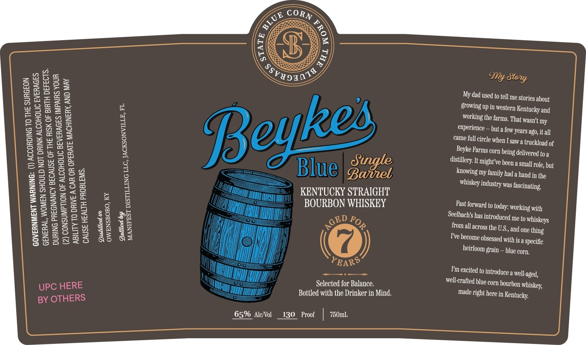

# TTB COLA Label Images - TTBID 26146001000456

**Brand Name:** BEYKE'S BLUE

**Fanciful Name:** SINGLE BARREL

**Issue Date:** 06/05/2026

**Origin Code:** 16

**Product Class/Type:** 101

**Source:** [TTB Public COLA Registry](https://ttbonline.gov/colasonline/viewColaDetails.do?action=publicFormDisplay&ttbid=26146001000456)

## Label Images

### Back Label

## Extracted Label Text

*Text extracted via OCR - may contain errors*

**Detected Proof:** 130

### Back Label

IMPAIRS YOUR
'Y, AND MAY

RAGES I
LCOHOLIC BEVE!
R OR OPERATE MACHINER

CAUSE HEALTH PROBLEMS.

Distilled in

VILLE, FL.
Gee STILLING LLC, JACKSON)

2) CONSUMPTION OF Al
MANIFEST DI

=
zZ
<
=
=
b
Fe
2
s
i=}
S

ABILITY TO DRIVE A CAI
OWENSBORO, KY

(

UPC HERE
BY OTHERS

65% Alc/Vol

KENTUCKY STRAIGHT
BOURBON WHISKEY

DF
rem e

(@)

PEAR?
Selected for Balance. ’
Bottled with the Drinker in Mind.

130 Proof 750mL

My Story

My dad used to tell me Stories about
growing up in western Kentucky and
Working the farms, That wasn’t my
experience — but a few. Years ago, it all
came full circle when I saw a truckload of
Beyke Farms corn being delivered to a
distillery. It might've been a small Tole, but
knowing my family had a hand in the
whiskey ‘industry was fascinating.

Past forward to today: working with

Seelbach’s has introduced me to whiskeys

from all across the US., and one thing
T’ve become obsessed with is a Specific

heirloom grain — blue corn,

T'm excited to introduce a well-aged,
well-crafted blue corn bourbon whiskey,
made right here in Kentucky,
