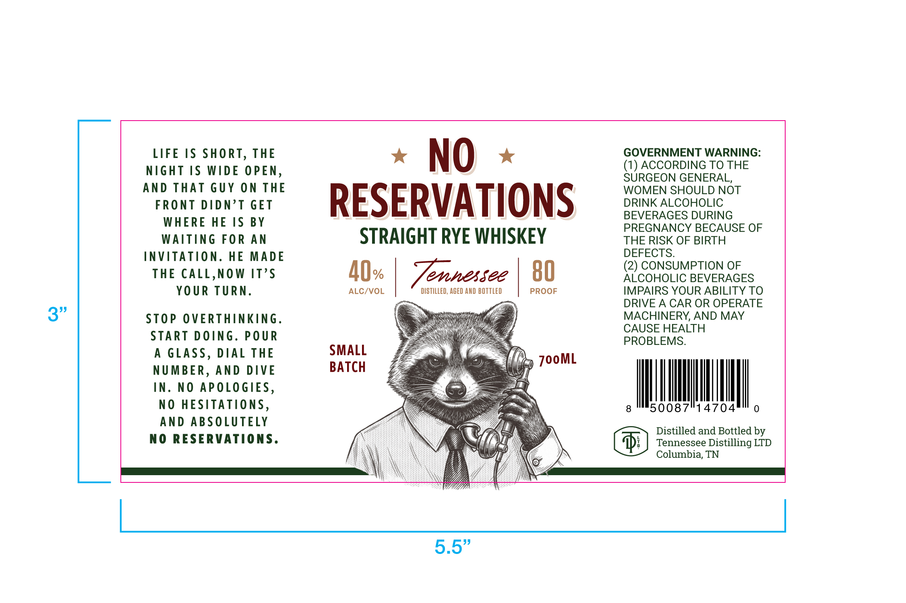

# TTB COLA Label Images - TTBID 26146001000470

**Brand Name:** NO RESERVATIONS

**Issue Date:** 06/03/2026

**Origin Code:** 43

**Product Class/Type:** 102

**Source:** [TTB Public COLA Registry](https://ttbonline.gov/colasonline/viewColaDetails.do?action=publicFormDisplay&ttbid=26146001000470)

## Label Images

### Label 1

## Extracted Label Text

*Text extracted via OCR - may contain errors*

### Label 1

GOVERNMENT WARNING

LIFE IS SHORT, THE

NIGHT IS WIDE OPEN

x NO «

(1) ACCORDING TO THE

AND THAT GUY ON THE

URGEON GENERAL,

WOMEN SHOULD NOT

FRONT DIDN’T GET

DRINK ALCOHOLIC

WHERE HE IS BY

RESERVATIONS

BEVERAGES DURING

PREGNANCY BECAUSE OF

WAITING FOR AN

STRAIGHT RYE WHISKEY

THE RISK OF BIRTH

INVITATION. HE MADE

DEFECTS.

(2) CONSUMPTION OF

THE CALL,NOW IT’S

AQ.

MAES SCL

80

ALCOHOLIC BEVERAGES

YOUR TURN

ALC/VOL

DISTILLED, AGED AND BOTTLED

PROOF

IMPAIRS YOUR ABILITY TO

DRIVE A CAR OR OPERATE

3”

STOP OVERTHINKING

MACHINERY, AND MAY

“i

CAUSE HEALTH

START DOING. POUR

e\

PROBLEMS.

A GLASS, DIAL THE

SMALL

BATCH

JooML

NUMBER, AND DIVE

IN. NO APOLOGIES

NO HESITATIONS

_

I

|

|

I

50087

14704

AND ABSOLUTELY

Le

NO RESERVATIONS.

\\

Distilled and Bottled by

\ 4

NX

yj

IS

Tennessee Distilling LTD

Columbia, TN

\

yj

———EE———————————————————— i

HL

5 5”
