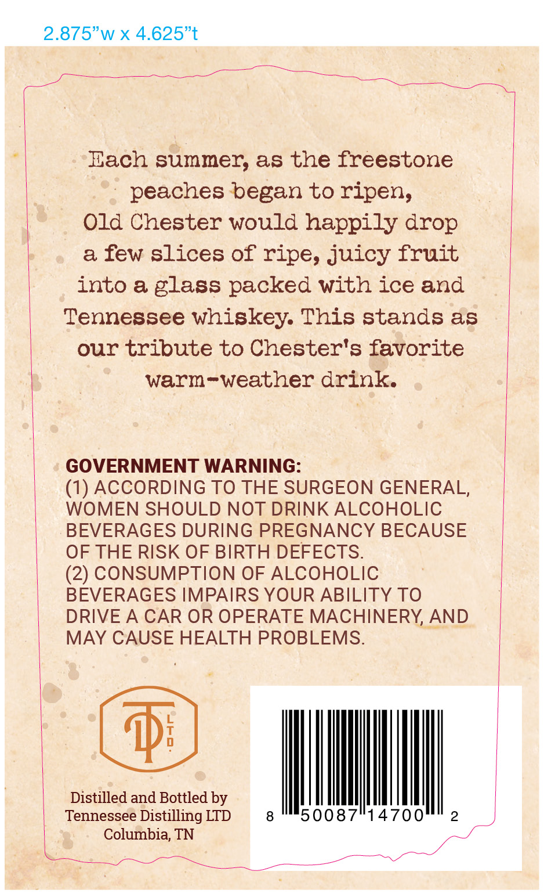
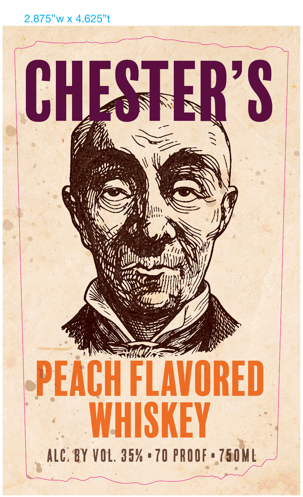

# TTB COLA Label Images - TTBID 26146001000490

**Brand Name:** CHESTER'S PEACH FLAVORED WHISKEY

**Issue Date:** 06/02/2026

**Origin Code:** 43

**Product Class/Type:** 149

**Source:** [TTB Public COLA Registry](https://ttbonline.gov/colasonline/viewColaDetails.do?action=publicFormDisplay&ttbid=26146001000490)

## Label Images

### Back Label

### Front Label

## Extracted Label Text

*Text extracted via OCR - may contain errors*

*1 image(s) excluded: text did not meet readability threshold*

### Back Label

2.875" w x 4.625”t

be ies a

SNe el adh Saari

So ee eee

Hach summer, as the freestone

peaches began to ripen,

Old Chester would happily drop

a few slices of ripe, juicy fruit

into a glass packed with ice and

Tennessee whiskey. This stands as

our tribute to Chester's favorite

warm-weather drink.

GOVERNMENT WARNING

(1) ACCORDING TO THE SURGEON GENERAL

WOMEN SHOULD NOT DRINK ALCOHOLIC

BEVERAGES DURING PREGNANCY BECAUSE

OF THE RISK OF BIRTH DEFECTS

(2) CONSUMPTION OF ALCOHOLIC

BEVERAGES IMPAIRS YOUR ABILITY TO

DRIVE A CAR OR OPERATE MACHINERY, AND

MAY CAUSE HEALTH PROBLEMS

Distilled and Bottled by

it

50087°14700

Tennessee Distilling LTD

Columbia, TN

pm

eee

——— s
