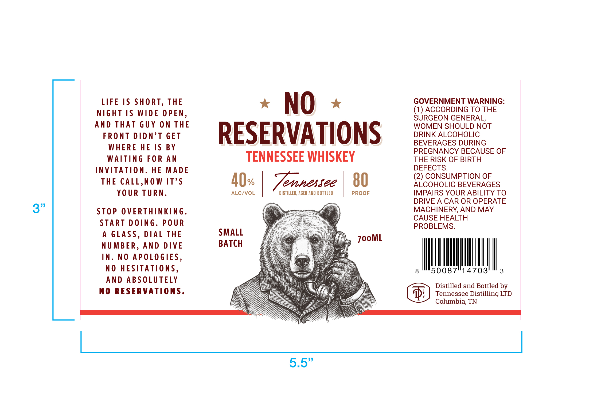

# TTB COLA Label Images - TTBID 26146001000498

**Brand Name:** NO RESERVATIONS

**Issue Date:** 06/02/2026

**Origin Code:** 43

**Product Class/Type:** 140

**Source:** [TTB Public COLA Registry](https://ttbonline.gov/colasonline/viewColaDetails.do?action=publicFormDisplay&ttbid=26146001000498)

## Label Images

### Label 1

## Extracted Label Text

*Text extracted via OCR - may contain errors*

### Label 1

LIFE IS SHORT, THE
NIGHT IS WIDE OPEN,
AND THAT GUY ON THE

FRONT DIDN’T GET

WHERE HE IS BY
WAITING FOR AN
INVITATION. HE MADE
THE CALL,NOW IT’S
YOUR TURN.

STOP OVERTHINKING.
START DOING. POUR
A GLASS, DIAL THE
NUMBER, AND DIVE
IN. NO APOLOGIES,
NO HESITATIONS,
AND ABSOLUTELY
NO RESERVATIONS.

x NO «
RESERVATIONS

TENNESSEE WHISKEY

AQ.

ALC/VOL

Tennessee

DISTILLED, AGED AND BOTTLED

GOVERNMENT WARNING:
(1) ACCORDING TO THE
SURGEON GENERAL,
WOMEN SHOULD NOT
DRINK ALCOHOLIC
BEVERAGES DURING
PREGNANCY BECAUSE OF
THE RISK OF BIRTH
DEFECTS.

(2) CONSUMPTION OF
ALCOHOLIC BEVERAGES
IMPAIRS YOUR ABILITY TO
DRIVE A CAR OR OPERATE
MACHINERY, AND MAY
CAUSE HEALTH
PROBLEMS.

8

Distilled and Bottled by
Tennessee Distilling LTD
Columbia, TN

50087°14703'" 3
