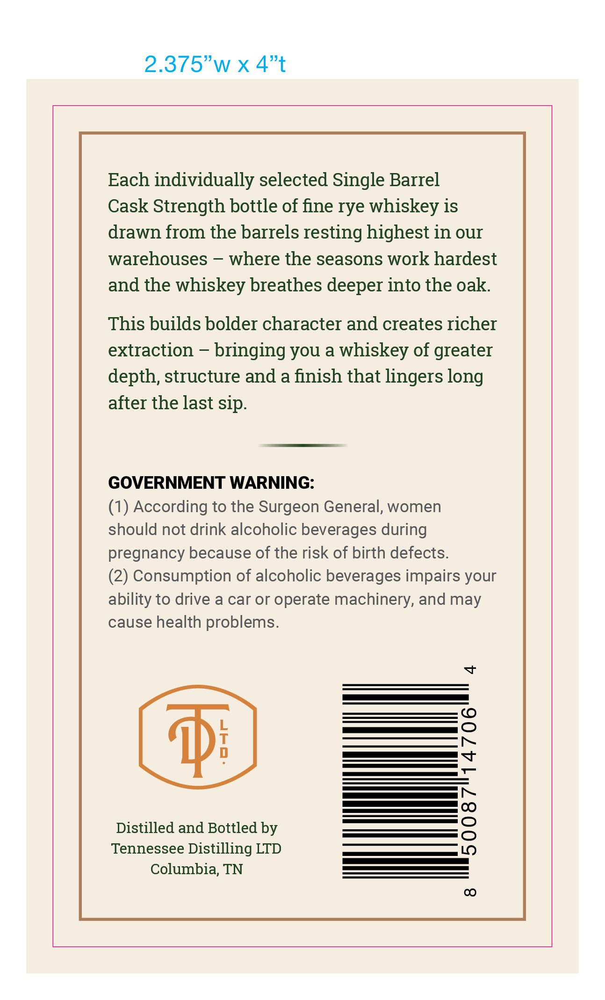
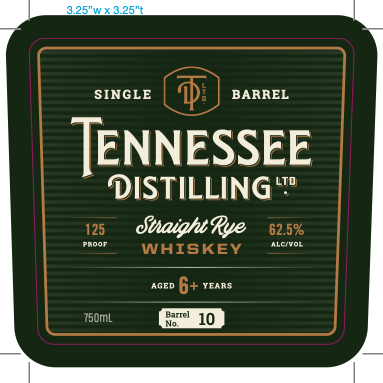

# TTB COLA Label Images - TTBID 26146001000511

**Brand Name:** TENNESSEE DISTILLING LTD.

**Fanciful Name:** SINGLE BARREL STRAIGHT RYE WHISKEY

**Issue Date:** 06/02/2026

**Origin Code:** 43

**Product Class/Type:** 102

**Source:** [TTB Public COLA Registry](https://ttbonline.gov/colasonline/viewColaDetails.do?action=publicFormDisplay&ttbid=26146001000511)

## Label Images

### Back Label

### Label 1

## Extracted Label Text

*Text extracted via OCR - may contain errors*

**Detected Proof:** 125

### Back Label

2.375"w x 4"t
Each individually selected Single Barrel
Cask Strength bottle of fine rye whiskey is
drawn from the barrels resting highest in our
warehouses
where the seasons work hardest
and the whiskey breathes deeper into the oak
This builds bolder character and creates richer
extraction
bringing you a whiskey of greater
depth, structure and a finish that lingers long
after the last sip.
GOVERNMENT WARNING:
(1) According to the Surgeon General, women
should not drink alcoholic beverages during
pregnancy because of the risk of birth defects.
(2) Consumption of alcoholic beverages impairs your
ability to drive a car or operate machinery, and may
cause health problems.
Y
@Di
8
Distilled and Bottled by
1
Tennessee Distilling LTD
Columbia, TN
0

### Label 1

o5wxs25"T
SINGLE
BARREL
TENNESSEE
LTD
DISTILLING"
125
UiaightRve
62.5%
Proot
alentol
WHISKEY
AGED
6+
YearS-
Hatme]
750mL
10
